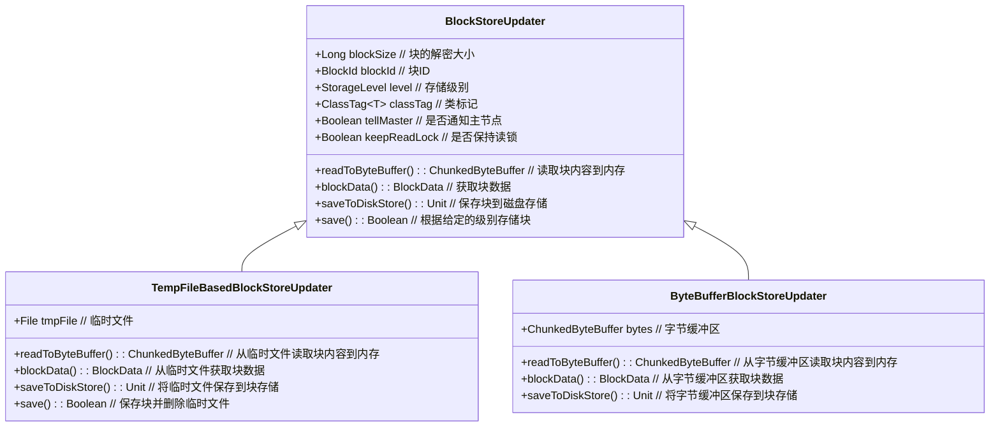

# updater

根据你提供的代码片段，下面是 `TempFileBasedBlockStoreUpdater` 和 `ByteBufferBlockStoreUpdater` 类的类图示例。类图展示了这些类与 `BlockStoreUpdater` 的继承关系，以及它们各自实现的方法。

### 类图解释

1. **BlockStoreUpdater** 是一个抽象类，定义了几个抽象方法和一个 `save()` 方法。
2. **TempFileBasedBlockStoreUpdater** 继承了 `BlockStoreUpdater`，并实现了所有抽象方法。它处理基于临时文件的数据块存储。
3. **ByteBufferBlockStoreUpdater** 也继承了 `BlockStoreUpdater`，并实现了所有抽象方法。它处理基于内存中的 `ChunkedByteBuffer` 的数据块存储。

这个类图展示了两个子类如何继承和实现 `BlockStoreUpdater` 类中的方法。
