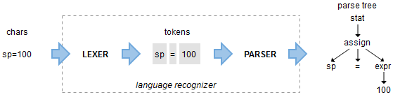

# ANTLR

ANTLR（Another Tool for Language Recognition）是一种强大的解析工具，用于构建编译器、解释器、转换器和数据处理工具。它帮助开发者从输入文本中生成解析树（parse tree），从而理解和处理结构化的输入数据。



## ANTLR 的主要功能

1. **词法分析（Lexical Analysis）**：
   - ANTLR 可以将输入的字符流分割成基本的标记（tokens），例如关键字、标识符、操作符等。这一步通常由词法分析器（Lexer）完成。

2. **语法分析（Parsing）**：
   - 在词法分析之后，ANTLR 使用语法规则（grammar）将标记序列转换为解析树。解析树反映了输入的语法结构，可以用来进一步生成抽象语法树（AST），或直接进行代码生成、解释执行等操作。

3. **生成解析器**：
   - ANTLR 可以根据定义的语法规则自动生成解析器代码。支持的编程语言包括 Java、Python、C#、JavaScript 等。开发者可以在这些编程语言中直接使用生成的解析器。

4. **支持多种语法规则**：
   - ANTLR 支持上下文无关文法（Context-Free Grammar, CFG），允许开发者定义复杂的语言结构。它支持左递归、嵌套规则、优先级解析等。

## ANTLR 的应用

- **编译器设计**：ANTLR 常用于构建编译器的前端部分，如解析源代码，生成抽象语法树。
- **语言解析**：可以用来解析编程语言、脚本语言或自定义 DSL（领域特定语言）。
- **数据转换**：从一种结构化数据格式转换为另一种，例如从 XML 到 JSON。
- **输入验证**：用于验证输入文本是否符合特定的语法规则。

## 简单示例

### 1. 安装 ANTLR 和 Python 运行时库

首先，你需要安装 ANTLR 和相应的 Python 运行时库。你可以使用 pip 来安装 ANTLR 的 Python 运行时：

```bash
pip install antlr4-python3-runtime
```

### 2. 定义语法 (Grammar)

创建一个名为 `Arithmetic.g4` 的文件，内容如下：

```antlr
grammar Arithmetic;

// 解析表达式的规则
expr:   expr ('*'|'/') expr  # MulDiv，在前，高优先级
    |   expr ('+'|'-') expr  # AddSub，在后，低优先级
    |   INT                  # Int
    |   '(' expr ')'         # Parens
    ;

// 定义整数的规则
INT :   [0-9]+ ;

// 跳过空白字符
WS  :   [ \t\n\r]+ -> skip ;
```

### 3. 生成解析器

使用 ANTLR 生成 Python 解析器。你需要下载 ANTLR JAR 文件，并使用以下命令来生成 Python 文件：

```bash
java -jar antlr-4.X-complete.jar -Dlanguage=Python3 Arithmetic.g4
```

这将生成几个 Python 文件，包括 `ArithmeticLexer.py` 和 `ArithmeticParser.py`。

### 4. 编写 Python 程序来解析表达式

接下来，创建一个 Python 文件 `main.py`，内容如下：

```python
import sys
from antlr4 import *
from ArithmeticLexer import ArithmeticLexer
from ArithmeticParser import ArithmeticParser

def main():
    # 输入的算术表达式
    expression = "1 + 2 * 3"

    # 创建词法分析器
    input_stream = InputStream(expression)
    lexer = ArithmeticLexer(input_stream)
    token_stream = CommonTokenStream(lexer)

    # 创建语法解析器
    parser = ArithmeticParser(token_stream)

    # 从 expr 规则开始解析
    tree = parser.expr()

    # 打印解析树
    print(tree.toStringTree(recog=parser))

if __name__ == '__main__':
    main()
```

### 5. 运行程序

使用 Python 运行 `main.py`：

```bash
python main.py
```

你会看到类似于以下内容的输出，它表示 `1 + 2 * 3` 的解析树：

```text
(expr (expr 1) + (expr (expr 2) * (expr 3)))
```

树状图，如下所示：


### 总结

这个例子展示了如何使用 Python 和 ANTLR 来定义语法并解析算术表达式。通过这种方法，你可以在 Python 中解析和处理各种自定义语言或表达式。
