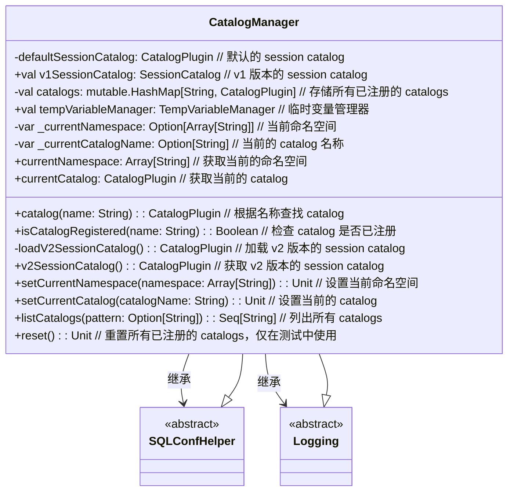

# CatalogManager

```mermaid
classDiagram
    class CatalogManager {
        -defaultSessionCatalog: CatalogPlugin // 默认的 session catalog
        +val v1SessionCatalog: SessionCatalog // v1 版本的 session catalog
        -val catalogs: mutable.HashMap[String, CatalogPlugin] // 存储所有已注册的 catalogs
        +val tempVariableManager: TempVariableManager // 临时变量管理器
        -var _currentNamespace: Option[Array[String]] // 当前命名空间
        -var _currentCatalogName: Option[String] // 当前的 catalog 名称
        +catalog(name: String): CatalogPlugin // 根据名称查找 catalog
        +isCatalogRegistered(name: String): Boolean // 检查 catalog 是否已注册
        -loadV2SessionCatalog(): CatalogPlugin // 加载 v2 版本的 session catalog
        +v2SessionCatalog(): CatalogPlugin // 获取 v2 版本的 session catalog
        +currentNamespace: Array[String] // 获取当前的命名空间
        +setCurrentNamespace(namespace: Array[String]): Unit // 设置当前命名空间
        +currentCatalog: CatalogPlugin // 获取当前的 catalog
        +setCurrentCatalog(catalogName: String): Unit // 设置当前的 catalog
        +listCatalogs(pattern: Option[String]): Seq[String] // 列出所有 catalogs
        +reset(): Unit // 重置所有已注册的 catalogs，仅在测试中使用
    }

    class SQLConfHelper {
        <<abstract>>
    }

    class Logging {
        <<abstract>>
    }

    CatalogManager --> SQLConfHelper : 继承
    CatalogManager --> Logging : 继承
    SQLConfHelper <|-- CatalogManager
    Logging <|-- CatalogManager
```
