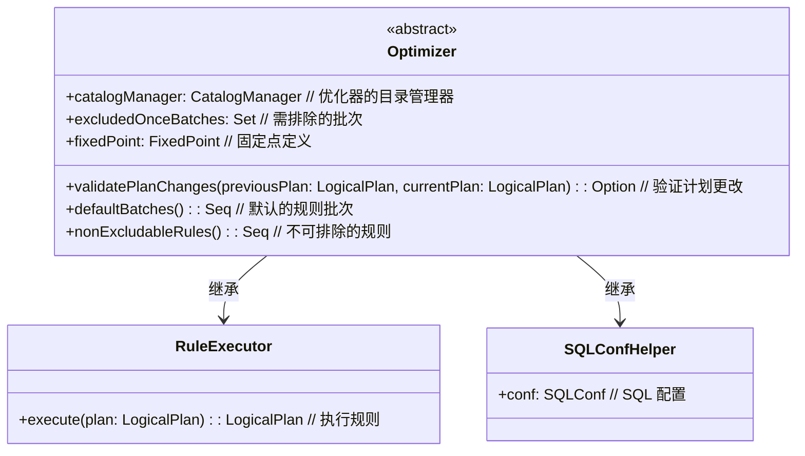

# Optimizer

```mermaid
classDiagram
    class Optimizer {
        <<abstract>>
        +catalogManager: CatalogManager // 优化器的目录管理器
        +validatePlanChanges(previousPlan: LogicalPlan, currentPlan: LogicalPlan): Option<String> // 验证计划更改
        +excludedOnceBatches: Set<String> // 需排除的批次
        +fixedPoint: FixedPoint // 固定点定义
        +defaultBatches(): Seq<Batch> // 默认的规则批次
        +nonExcludableRules(): Seq<String> // 不可排除的规则
    }

    class RuleExecutor {
        +execute(plan: LogicalPlan): LogicalPlan // 执行规则
    }

    class SQLConfHelper {
        +conf: SQLConf // SQL 配置
    }

    Optimizer --> RuleExecutor : 继承
    Optimizer --> SQLConfHelper : 继承
```

在这个类图中，我为 `Optimizer` 类的几个成员添加了中文注释。如果你需要更多的类和成员，可以继续按照这个格式添加。
