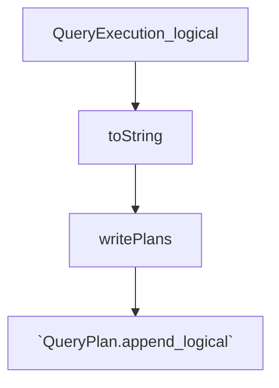
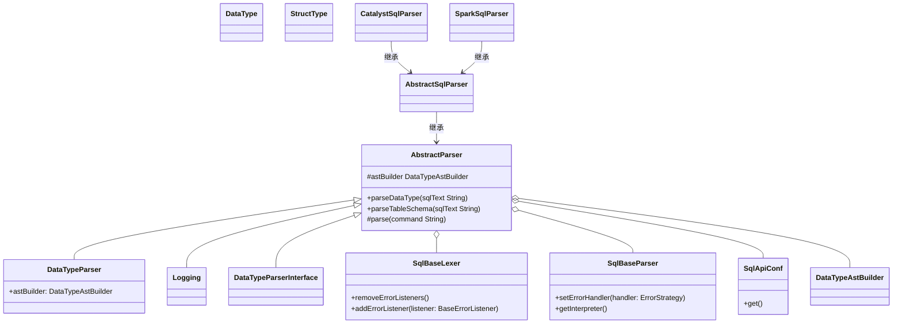

# plan

```scalar
  private def writePlans(append: String => Unit, maxFields: Int): Unit = {
```


```mermaid
graph TD
QueryExecution_logical-->a[toString]
a-->writePlans
writePlans-->c[`QueryPlan.append_logical`]
```


```mermaid
classDiagram
    AbstractParser <|-- DataTypeParser
    AbstractParser <|-- Logging
    AbstractParser <|-- DataTypeParserInterface
    AbstractParser o-- SqlBaseLexer
    AbstractParser o-- SqlBaseParser
    AbstractParser o-- SqlApiConf
    AbstractParser o-- DataTypeAstBuilder
    
    AbstractParser : +parseDataType(sqlText String)
    AbstractParser : +parseTableSchema(sqlText String)
    AbstractParser : #astBuilder  DataTypeAstBuilder
    AbstractParser : #parse(command String)

    class DataTypeParser {
        +astBuilder: DataTypeAstBuilder
    }
    
    class SqlBaseLexer {
        +removeErrorListeners()
        +addErrorListener(listener: BaseErrorListener)
    }

    class SqlBaseParser {
        +setErrorHandler(handler: ErrorStrategy)
        +getInterpreter()
    }
    
    class SqlApiConf {
        +get()
    }

    class DataTypeAstBuilder

    class Logging

    class DataType
    
    class StructType

    AbstractSqlParser -->AbstractParser: 继承
    CatalystSqlParser -->AbstractSqlParser:继承
    SparkSqlParser -->AbstractSqlParser:继承
```
