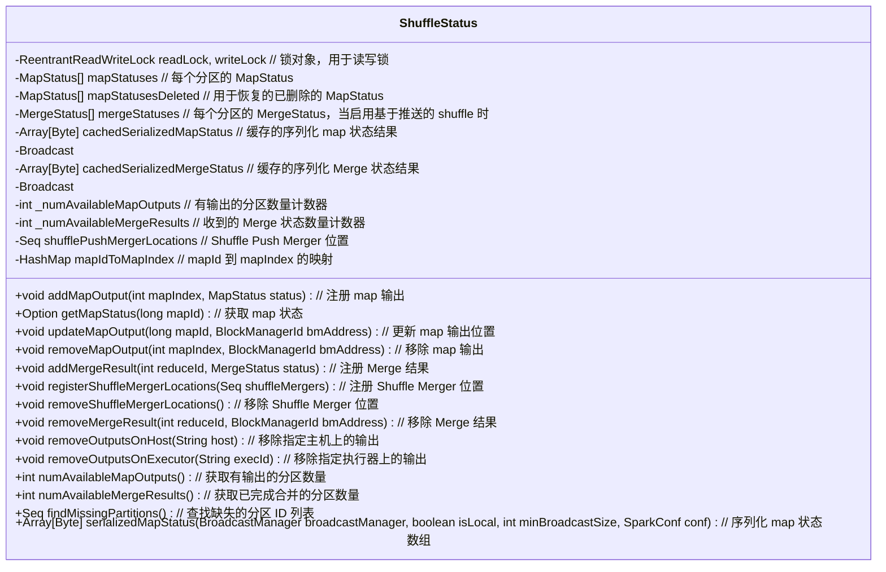

# ShuffleStatus

`ShuffleStatus` 类，它是 `MapOutputTrackerMaster` 的一个辅助类，用于跟踪和管理 `ShuffleMapStage` 的状态。这个类管理从 map 索引到 `MapStatus` 的映射，同时维护了序列化后的 map 状态的缓存，以加速任务对 map 输出状态的请求。以下是主要功能的解释：

1. **锁机制**：`ShuffleStatus` 类使用了读写锁 (`ReentrantReadWriteLock`)，通过 `withReadLock` 和 `withWriteLock` 方法来控制对共享数据的读写操作，确保线程安全。

2. **状态管理**：
   - `mapStatuses`：这是一个数组，存储了每个 map 分区的 `MapStatus`。如果某个分区的状态不可用，则对应的数组元素为 `null`。
   - `mergeStatuses`：在启用了基于 push 的 shuffle 时，这个数组保存了每个 shuffle 分区的 `MergeStatus`，用于跟踪每个 reducer 的 shuffle 状态。
   - `mapStatusesDeleted`：存储已删除的 `MapStatus`，用于恢复。

3. **缓存管理**：该类通过 `cachedSerializedMapStatus` 和 `cachedSerializedMergeStatus` 变量缓存了序列化后的 map 和 merge 状态，以减少重复序列化操作的开销。

4. **计数器**：
   - `_numAvailableMapOutputs`：跟踪当前有输出的 map 分区的数量。
   - `_numAvailableMergeResults`：跟踪已接收到的 merge 结果的数量。

5. **映射关系**：
   - `mapIdToMapIndex`：维护了从 `mapId` 到 `mapIndex` 的映射关系，用于减少搜索开销。

6. **输出管理**：
   - `addMapOutput`：注册 map 输出，如果已有注册位置则更新。
   - `getMapStatus`：根据 `mapId` 获取对应的 `MapStatus`。
   - `updateMapOutput`：更新 map 输出位置（例如在迁移期间）。
   - `removeMapOutput`：移除由指定 block manager 提供的 map 输出。

7. **合并结果管理**：
   - `addMergeResult`：注册一个合并结果。
   - `removeMergeResult`：移除由指定 block manager 提供的合并结果。

8. **主机和执行器管理**：
   - `removeOutputsOnHost` 和 `removeOutputsOnExecutor`：移除与指定主机或执行器相关的所有 shuffle 输出。

9. **序列化和缓存管理**：
   - `serializedMapStatus` 方法将 `mapStatuses` 数组序列化为高效的压缩格式，并实现了缓存，以加快后续请求。

这个类的设计非常注重性能优化和线程安全，确保在高并发环境下能够稳定高效地管理 shuffle 的状态。
