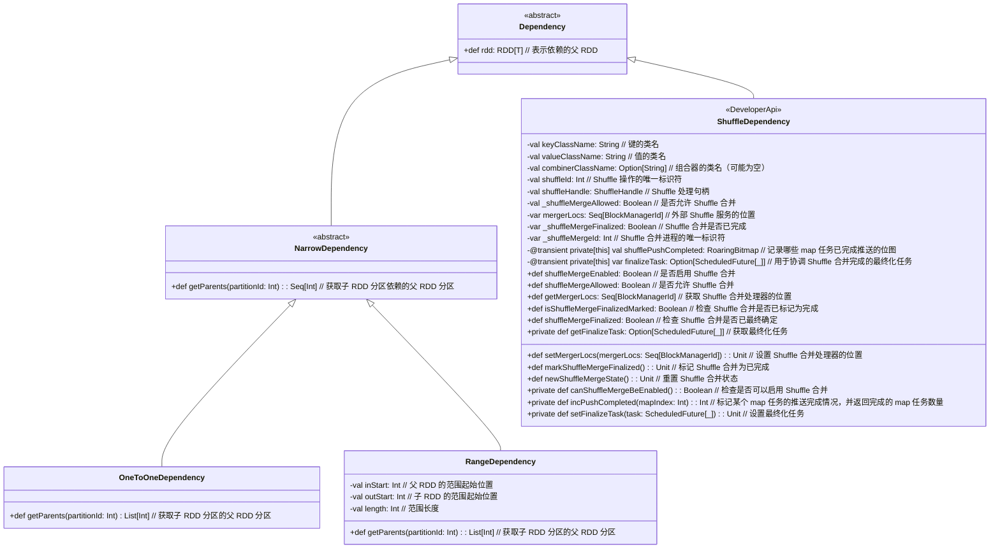

# Dependency

Dependency在 Spark 的 RDD 依赖管理中扮演着重要角色。它们主要用于描述和管理 RDD 之间的依赖关系，从而支持数据处理的执行计划。



### 主要功能

1. **`Dependency` 类**
   - 这是一个抽象类，表示 RDD 之间的依赖关系。它的主要功能是定义 RDD 依赖的基本属性，如提供父 RDD。

2. **`NarrowDependency` 类**
   - 这是 `Dependency` 的一个子类，表示窄依赖，即每个子 RDD 分区仅依赖于一个或少数几个父 RDD 分区。窄依赖允许 pipelined 执行（即可以将多个操作串联在一起执行）。例如，`map` 和 `filter` 操作通常会创建窄依赖。

3. **`ShuffleDependency` 类**
   - 这是 `Dependency` 的另一个子类，表示基于 shuffle 的依赖。这种依赖通常发生在需要重新分区数据的操作中，例如 `reduceByKey` 或 `groupByKey`。这种依赖在 Spark 中涉及到数据的洗牌（shuffle），因此需要处理更复杂的调度和数据传输。`ShuffleDependency` 支持多种 shuffle 配置选项，如 `mapSideCombine` 和 `shuffleWriterProcessor`，并跟踪 shuffle 合并的状态。

4. **`OneToOneDependency` 类**
   - 表示父 RDD 和子 RDD 之间的一对一依赖关系。这意味着每个子 RDD 分区只依赖于一个对应的父 RDD 分区。例如，当对子 RDD 执行 `mapPartitions` 操作时，通常会创建这种依赖。

5. **`RangeDependency` 类**
   - 表示范围依赖关系，适用于父 RDD 和子 RDD 之间的一对多依赖关系。它指定了一个范围，表示子 RDD 中的某些分区依赖于父 RDD 中的某些分区。例如，当对 RDD 执行操作时可能会有这样的依赖关系，其中子 RDD 的某些分区会依赖于父 RDD 的一个连续范围的分区。

### 主要方法

- **`Dependency`**
  - `def rdd: RDD[T]`: 返回依赖的父 RDD。

- **`NarrowDependency`**
  - `def getParents(partitionId: Int): Seq[Int]`: 获取给定子 RDD 分区的父 RDD 分区列表。

- **`ShuffleDependency`**
  - `def shuffleMergeEnabled: Boolean`: 是否启用 shuffle 合并。
  - `def shuffleMergeAllowed: Boolean`: 是否允许 shuffle 合并。
  - `def setMergerLocs(mergerLocs: Seq[BlockManagerId]): Unit`: 设置用于 shuffle 合并的外部 Shuffle 服务位置。
  - `def markShuffleMergeFinalized(): Unit`: 标记 shuffle 合并已完成。
  - `def incPushCompleted(mapIndex: Int): Int`: 标记 map 任务的推送完成情况，并返回完成的 map 任务数量。
  
- **`OneToOneDependency`**
  - `def getParents(partitionId: Int): List[Int]`: 获取子 RDD 分区的父 RDD 分区。

- **`RangeDependency`**
  - `def getParents(partitionId: Int): List[Int]`: 获取子 RDD 分区的父 RDD 分区。
  - `val inStart: Int`: 父 RDD 的起始范围。
  - `val outStart: Int`: 子 RDD 的起始范围。
  - `val length: Int`: 范围长度。

### 例子

1. **`OneToOneDependency` 示例**

   假设你有一个 RDD `rdd1`，并通过 `map` 操作创建了一个新的 RDD `rdd2`。这里 `rdd2` 的每个分区仅依赖于 `rdd1` 中的一个对应分区。这种依赖关系就是 `OneToOneDependency`。

   ```scala
   val rdd1 = sc.parallelize(Seq(1, 2, 3, 4), 2)
   val rdd2 = rdd1.map(x => x * 2)
   ```

   在这个例子中，`rdd2` 的 `OneToOneDependency` 会反映 `rdd1` 的分区依赖。

2. **`RangeDependency` 示例**

   假设你有一个父 RDD `rdd1`，并通过一个操作将它的一部分分区映射到子 RDD `rdd2`。例如，如果 `rdd1` 有 10 个分区，而 `rdd2` 需要这些分区的一个范围来创建自己的分区，那么这会形成一个 `RangeDependency`。

   ```scala
   val rdd1 = sc.parallelize(1 to 100, 10)
   val rdd2 = rdd1.zipWithIndex.map { case (value, index) => (index % 5, value) }.groupByKey()
   ```

   在这个例子中，`rdd2` 的每个分区可能依赖于 `rdd1` 的一个分区范围，具体取决于 `groupByKey` 的操作方式。

### RangeDependency

`RangeDependency` 类表示父 RDD 和子 RDD 之间的范围依赖关系。在这种依赖关系中，父 RDD 的一部分分区（即一个连续的范围）与子RDD的一个连续范围一一对应。
**主要参数:**

- **`rdd`**: 父 RDD（即依赖的源 RDD）。
- **`inStart`**: 父 RDD 中的开始分区索引（即范围的起始分区）。
- **`outStart`**: 子 RDD 中的开始分区索引（即范围的起始分区）。
- **`length`**: 范围的长度（即父 RDD 和子 RDD 的分区范围长度）。

**主要方法:**

- **`getParents(partitionId: Int): List[Int]`**: 根据子 RDD 的分区索引，返回对应的父 RDD 分区索引。如果子 RDD 的分区索引在 `outStart` 和 `outStart + length` 范围内，则计算其对应的父 RDD 分区索引；否则返回空列表。

### 示例

假设你有一个父 RDD `rdd1` 和一个子 RDD `rdd2`，并且你希望 `rdd2` 的分区依赖于 `rdd1` 的某个连续范围的分区。

**示例代码:**

```scala
import org.apache.spark.rdd.RDD
import org.apache.spark.{SparkConf, SparkContext}
import org.apache.spark.rdd.RDD

// 初始化 SparkContext
val conf = new SparkConf().setAppName("RangeDependencyExample").setMaster("local")
val sc = new SparkContext(conf)

// 创建父 RDD
val rdd1 = sc.parallelize(1 to 10, 5) // 5 个分区的 RDD，包含 1 到 10 的整数

// 创建子 RDD，假设它从父 RDD 的第 2 个分区到第 4 个分区
val rdd2 = new RDD[Int](sc, Nil) {
  override def compute(split: Partition, context: TaskContext): Iterator[Int] = {
    Iterator.empty
  }

  override protected def getPartitions: Array[Partition] = {
    Array.empty
  }
}

// 创建 RangeDependency
val rangeDependency = new RangeDependency[Int](rdd1, inStart = 2, outStart = 0, length = 3)

// 验证子 RDD 的每个分区依赖于父 RDD 的分区
val partitionId = 1 // 子 RDD 的分区索引
println(rangeDependency.getParents(partitionId)) // 输出: List(3)
```
