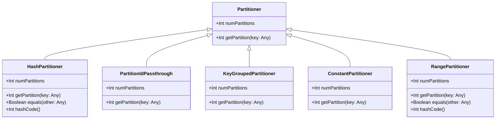

# Partationer

```scala
abstract class Partitioner extends Serializable {
  def numPartitions: Int
  def getPartition(key: Any): Int
}
```

`Partitioner` 是一个抽象类，定义了对 RDD 进行分区的基本结构。它有两个抽象方法：

- `numPartitions`：返回分区的数量。
- `getPartition(key: Any)`：返回给定键的分区 ID。



该类图展示了 `Partitioner` 抽象类及其实现类的结构和主要方法。每个类都继承了 `Partitioner` 并实现了其抽象方法。

### Partitioner 对象

```scala
object Partitioner {
  def defaultPartitioner(rdd: RDD[_], others: RDD[_]*): Partitioner = { ... }
  private def isEligiblePartitioner(hasMaxPartitioner: RDD[_], rdds: Seq[RDD[_]]): Boolean = { ... }
}
```

`Partitioner` 对象包含了默认的分区器选择逻辑。`defaultPartitioner` 方法根据给定的 RDD 集合选择最合适的分区器。如果已存在一个合理的分区器，则使用该分区器，否则创建一个新的 `HashPartitioner`。`isEligiblePartitioner` 方法用于判断现有的分区器是否满足要求。

### HashPartitioner 类

```scala
class HashPartitioner(partitions: Int) extends Partitioner {
  def numPartitions: Int = partitions
  def getPartition(key: Any): Int = key match { ... }
}
```

`HashPartitioner` 是一种基于哈希的分区器。它将键通过 Java 的 `hashCode` 方法哈希，并使用 `Utils.nonNegativeMod` 方法将哈希值映射到特定的分区中。这个分区器适用于键可以通过哈希函数有效分散的情况。

### PartitionIdPassthrough 类

```scala
private[spark] class PartitionIdPassthrough(override val numPartitions: Int) extends Partitioner {
  override def getPartition(key: Any): Int = key.asInstanceOf[Int]
}
```

`PartitionIdPassthrough` 是一个简单的分区器，直接使用键值作为分区 ID。它通常用于键已经是分区 ID 的情况。

### KeyGroupedPartitioner 类

```scala
private[spark] class KeyGroupedPartitioner(
    valueMap: mutable.Map[Seq[Any], Int],
    override val numPartitions: Int) extends Partitioner { ... }
```

`KeyGroupedPartitioner` 是一个基于键的分区器。它使用一个映射 `valueMap` 将特定的键分配到特定的分区，用于确保同样的键值被分到同一个分区中，通常用于联接操作中。

### ConstantPartitioner 类

```scala
private[spark] class ConstantPartitioner extends Partitioner {
  override def numPartitions: Int = 1
  override def getPartition(key: Any): Int = 0
}
```

`ConstantPartitioner` 是一个固定分区器，它将所有记录分到单一的分区中。

### RangePartitioner 类

```scala
class RangePartitioner[K : Ordering : ClassTag, V](
    partitions: Int,
    rdd: RDD[_ <: Product2[K, V]],
    private var ascending: Boolean = true,
    val samplePointsPerPartitionHint: Int = 20) extends Partitioner { ... }
```

`RangePartitioner` 是一种基于范围的分区器。它通过对 RDD 的内容进行采样，确定每个分区的范围。然后将记录按键的顺序分配到相应的范围内。它通常用于需要对键排序的情况。

总的来说，这段代码展示了 Spark 中如何通过不同的分区器策略来对数据进行有效分区，从而在并行计算中提高性能。
