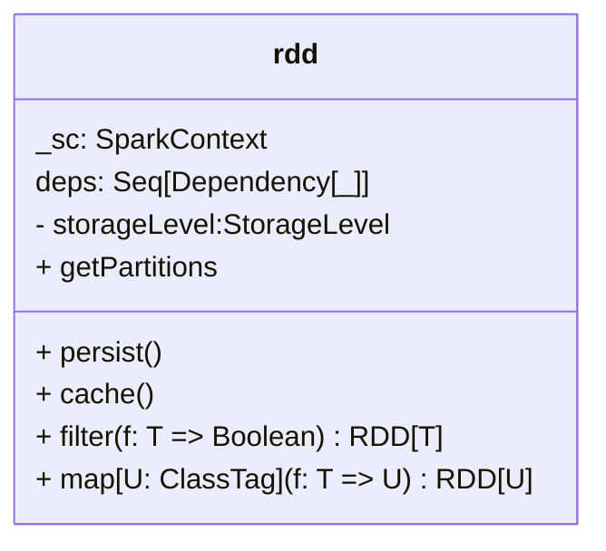
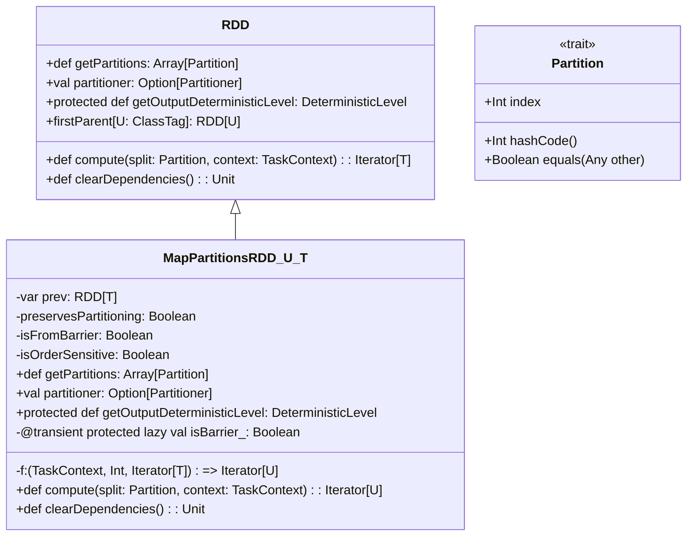

# RDD

```mermaid
classDiagram
    class rdd {
        _sc: SparkContext
        deps: Seq[Dependency[_]]
        - storageLevel:StorageLevel

        + getPartitions
        + persist()
        + cache()
        + filter(f: T => Boolean) RDD[T]
        + map[U: ClassTag](f: T => U) RDD[U]
    }

```

```mermaid
classDiagram
    class RDD {
        +def compute(split: Partition, context: TaskContext): Iterator[T]
        +def getPartitions: Array[Partition]
        +val partitioner: Option[Partitioner]
        +def clearDependencies(): Unit
        +protected def getOutputDeterministicLevel: DeterministicLevel
        +firstParent[U: ClassTag]: RDD[U] 
    }

    class MapPartitionsRDD_U_T {
        -var prev: RDD[T]
        -f: (TaskContext, Int, Iterator[T]) => Iterator[U]
        -preservesPartitioning: Boolean
        -isFromBarrier: Boolean
        -isOrderSensitive: Boolean
        +def compute(split: Partition, context: TaskContext): Iterator[U]
        +def getPartitions: Array[Partition]
        +val partitioner: Option[Partitioner]
        +def clearDependencies(): Unit
        +protected def getOutputDeterministicLevel: DeterministicLevel
        -@transient protected lazy val isBarrier_: Boolean
    }
    RDD <|-- MapPartitionsRDD_U_T


    class Partition {
      <<trait>>
      +Int index
      +Int hashCode()
      +Boolean equals(Any other)
    }
  
```
