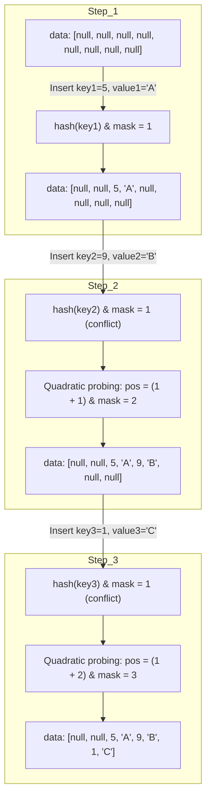
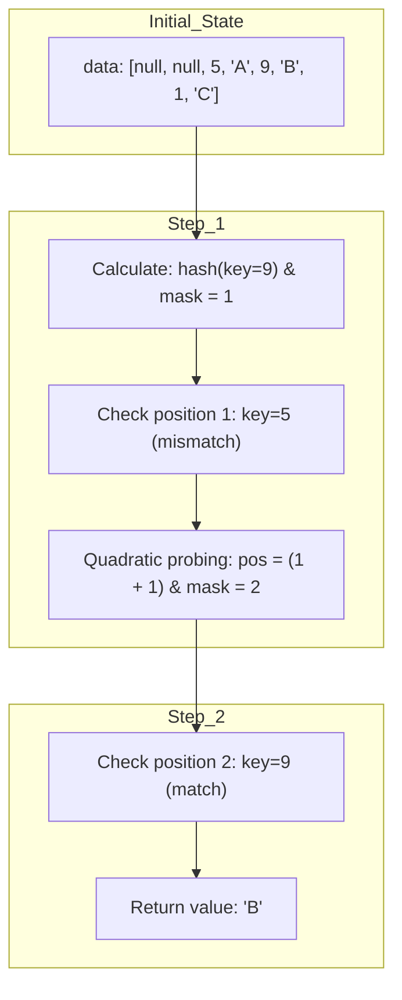

# AppendOnlyMap

`AppendOnlyMap` 是一个基于开放地址法的哈希表实现，主要优化了追加操作，适用于只需要增加或更新元素的场景，而不需要删除元素。下面我会为你解释它的工作原理，并提供一个示例来帮助你理解。

## 工作原理

- **哈希表的存储**：`AppendOnlyMap` 使用一个一维数组 `data` 来存储键值对。为了优化内存局部性，键和值被依次存储在数组中，即 `key0, value0, key1, value1, key2, value2, ...`。

- **哈希函数和探查**：这个哈希表使用二次探查法 (Quadratic Probing) 来处理哈希冲突。初始时，哈希值由 `rehash` 函数计算得出，并与掩码 `mask` 进行与操作来确定插入位置。如果位置已被占用，算法会依次尝试下一个位置，增量为 `i`，直到找到空闲位置。

- **自动扩容**：当元素数量达到阈值 `growThreshold` 时，哈希表会自动扩容。扩容操作会将哈希表容量加倍，并重新分布现有的键值对。

## 插入

下面是使用 Mermaid 的类图来描述 `AppendOnlyMap` 的插入、冲突处理和二次寻址过程的示例。这个图展示了一个初始大小为 4 的数组（`data`），然后展示了几个插入操作，以及如何处理冲突和二次寻址。



## 插入步骤

1. **Step 1**: 初始化一个空数组 `data`，大小为 4（因此数组大小为 8，存储 `key` 和 `value` 的配对）。首先插入 `key1=5, value1='A'`，计算 `hash(5) & mask = 1`，没有冲突，直接插入到位置 1。
2. **Step 2**: 插入 `key2=9, value2='B'`，计算 `hash(9) & mask = 1`，发生冲突。进行二次寻址，`pos = (1 + 1) & mask = 2`，然后插入到位置 2。
3. **Step 3**: 插入 `key3=1, value3='C'`，计算 `hash(1) & mask = 1`，再次发生冲突。二次寻址，`pos = (1 + 2) & mask = 3`，然后插入到位置 3。

这个图例展示了当插入一个新的键值对时，如果位置已经被占用（冲突），如何使用二次寻址找到一个新的位置插入数据。

查找一个键（`key`）的过程也涉及使用哈希值和二次寻址。如果最初计算的索引位置已经被占用且不匹配，我们需要逐步检查可能的备选位置，直到找到目标键或确定键不存在。

## 查找

假设我们要查找 `key=9`，在前面的数组中我们已经插入了以下数据：

```text
data: [null, null, 5, 'A', 9, 'B', 1, 'C']
```

### 查找步骤

1. **计算初始位置**：  
   计算 `hash(key) & mask` 得到初始位置 `pos`。
   - 对于 `key=9`，假设 `hash(9) & mask = 1`。

2. **检查冲突并二次寻址**：  
   如果在初始位置 `pos` 找到的键与目标键不匹配，就需要进行二次寻址来检查下一个可能的位置。
   - 在位置 `1`，找到的键是 `5`，与 `9` 不匹配。
   - 进行二次寻址，`pos = (1 + 1) & mask = 2`。

3. **找到目标键**：  
   在新的位置 `pos=2`，找到的键是 `9`，与目标键匹配，返回对应的值 `'B'`。

## 查找示意图



## 查找过程总结

- **初始查找**：通过 `hash(key) & mask` 计算得到的索引来进行初步查找。
- **二次寻址**：如果在计算得到的位置没有找到匹配的键，则使用二次寻址算法检查下一个可能的位置。
- **查找成功**：找到目标键并返回对应的值。

通过这种方法，`AppendOnlyMap` 可以在存在冲突的情况下有效地查找数据。

## 迭代器

迭代器在排序过程中破坏AppendOnlyMap 的结构，因此排序完成后，原来的 ExternalAppendOnlyMap 将无法再被有效地使用。

### 代码分析

1. **标记为销毁**：
   ```scala
   destroyed = true
   ```
   设置 `destroyed` 标志为 `true`，表示 `ExternalAppendOnlyMap` 在排序后将不再有效。

2. **重新排列 KV 对**：
   ```scala
   var keyIndex, newIndex = 0
   while (keyIndex < capacity) {
     if (data(2 * keyIndex) != null) {
       data(2 * newIndex) = data(2 * keyIndex)
       data(2 * newIndex + 1) = data(2 * keyIndex + 1)
       newIndex += 1
     }
     keyIndex += 1
   }
   ```
   这里的代码将非空的键值对从 `data` 数组的前半部分移到数组的前面。`data` 数组的索引 `2 * keyIndex` 用于存储键，`2 * keyIndex + 1` 用于存储值。这个过程将所有有效的键值对整理到数组的开头，同时保持它们的顺序。

3. **断言**：
   
   ```scala
   assert(curSize == newIndex + (if (haveNullValue) 1 else 0))
   ```
   这个断言确保排序后的元素个数与当前大小 `curSize` 匹配。`haveNullValue` 是一个布尔标志，指示是否有 `null` 值存在。
   
4. **排序**：
   ```scala
   new Sorter(new KVArraySortDataFormat[K, AnyRef]).sort(data, 0, newIndex, keyComparator)
   ```
   使用 `Sorter` 对 `data` 数组中的键值对进行排序。排序范围是从 `0` 到 `newIndex`，使用 `keyComparator` 进行比较。

5. **返回迭代器**：
   ```scala
   new Iterator[(K, V)] {
     var i = 0
     var nullValueReady = haveNullValue
     def hasNext: Boolean = (i < newIndex || nullValueReady)
     def next(): (K, V) = {
       if (nullValueReady) {
         nullValueReady = false
         (null.asInstanceOf[K], nullValue)
       } else {
         val item = (data(2 * i).asInstanceOf[K], data(2 * i + 1).asInstanceOf[V])
         i += 1
         item
       }
     }
   }
   ```
   这个匿名迭代器实现了 `Iterator` 接口，提供按排序顺序访问键值对的功能。
   
   - `hasNext`：检查是否还有元素可以迭代。它会在 `i` 小于 `newIndex` 或者 `nullValueReady` 为 `true` 时返回 `true`。
   - `next`：返回下一个键值对。如果有 `null` 值，首先返回 `null` 值，然后继续返回排序后的元素。

### 总结

`destructiveSortedIterator` 方法通过破坏 `ExternalAppendOnlyMap` 的有效性，将键值对按键排序，并返回一个迭代器用于遍历排序后的键值对。这种方法的优势是可以在排序过程中节省内存，但代价是破坏了原有的数据结构。因此，该方法适用于只需要一次性排序和遍历的场景。
