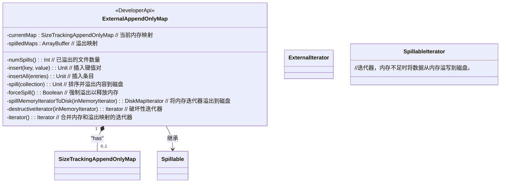
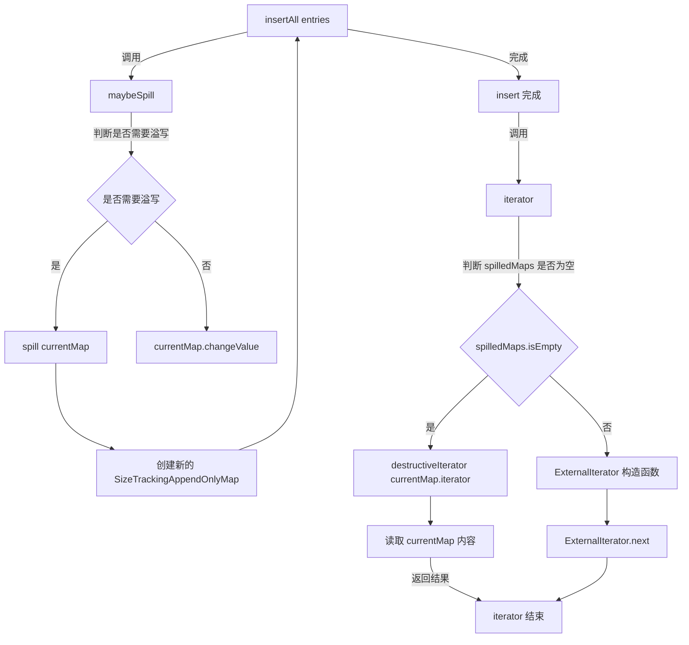

# ExternalAppendOnlyMap

`ExternalAppendOnlyMap` 是一个可以在内存不足时将排序内容溢出到磁盘的追加映射类。这个类主要用于处理大规模数据时，内存可能不足以存储所有数据的情况。它通过将数据分两次处理来完成任务：

1. **合并值**：首先，将值合并到组合器中，并根据需要对其进行排序和溢出到磁盘。
2. **合并组合器**：然后，从磁盘读取组合器并将它们合并在一起。

### 主要功能

- **溢出管理**：当内存中的数据超过一定阈值时，将数据溢出到磁盘以避免内存不足。
- **排序与合并**：在内存和磁盘之间进行排序和合并操作，以便高效处理大规模数据。
- **内存跟踪**：跟踪内存使用情况，并根据需要释放内存。

### 主要方法

1. **`insert(key: K, value: V)`**：将指定的键值对插入到映射中。如果当前内存不足，会将数据溢出到磁盘。**相同key根据combiner合并**

2. **`insertAll(entries: Iterator[Product2[K, V]])`**：将一组键值对插入到映射中，并在内存不足时将数据溢出到磁盘。

3. **`spill(collection: SizeTracker)`**：将当前内存中的数据排序并溢出到磁盘。

4. **`forceSpill()`**：强制将当前内存中的数据溢出到磁盘，以释放内存。

5. **`iterator`**：返回一个迭代器，用于遍历映射中的所有键值对。如果数据已被溢出到磁盘，则会从磁盘中读取数据。

6. **`destructiveIterator(inMemoryIterator: Iterator[(K, C)])`**：返回一个破坏性迭代器，遍历当前内存中的所有键值对。

这个类图包括了 `ExternalAppendOnlyMap` 及其相关的类，并且对主要成员进行了注释。你可以根据这个示例调整注释或添加更多细节。

### merge-sort

上面每次调用迭代器，里面实际上就进行排序，因此spill到磁盘的结果是有序的，memory是无序的。当ExternamAppendOnlyMap调用迭代器时，需要合并两个内容。这里内存中的map先调用迭代器变为有序，然后进行归并排序。
