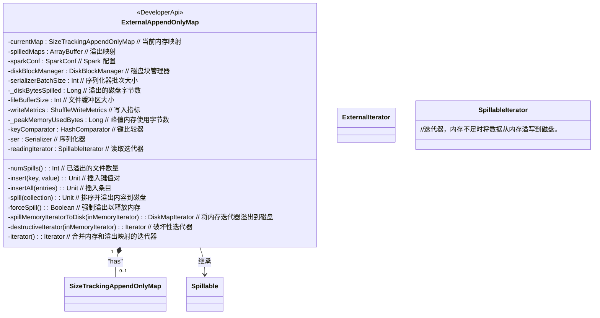
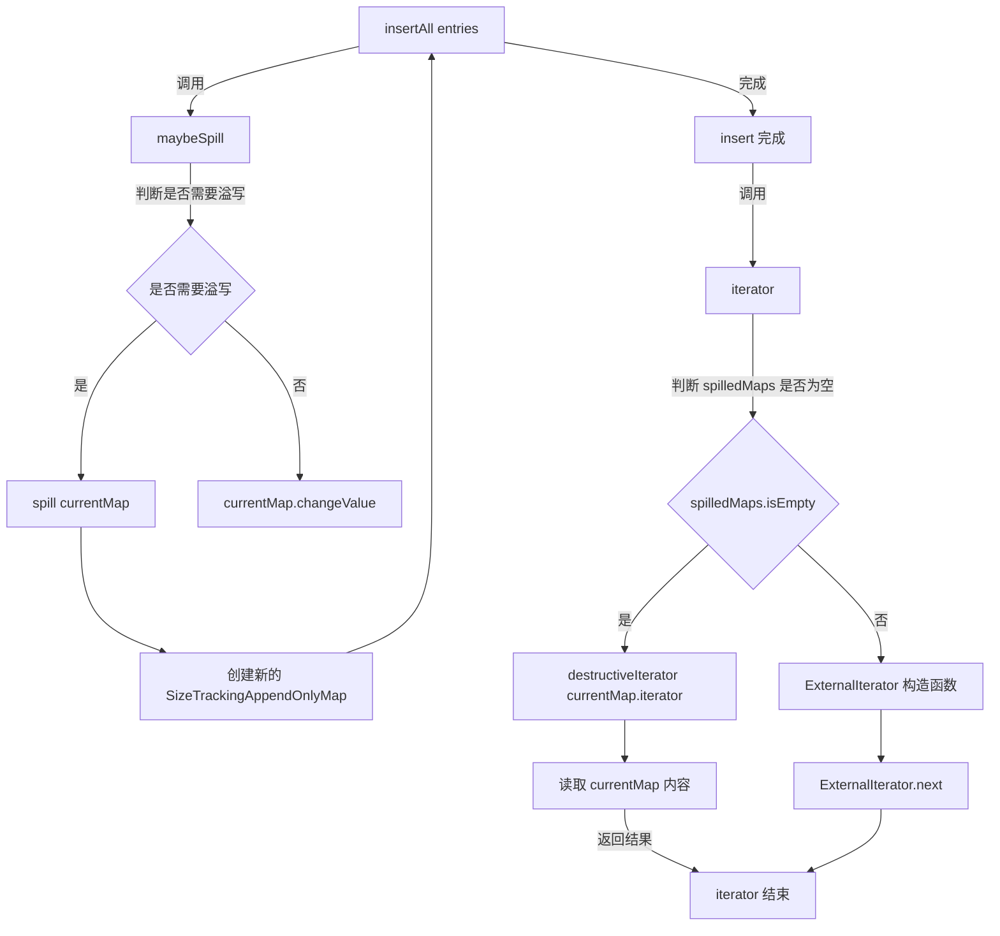

# ExternalAppendOnlyMap

`ExternalAppendOnlyMap` 是一个可以在内存不足时将排序内容溢出到磁盘的追加映射类。这个类主要用于处理大规模数据时，内存可能不足以存储所有数据的情况。它通过将数据分两次处理来完成任务：

1. **合并值**：首先，将值合并到组合器中，并根据需要对其进行排序和溢出到磁盘。
2. **合并组合器**：然后，从磁盘读取组合器并将它们合并在一起。

### 主要功能

- **溢出管理**：当内存中的数据超过一定阈值时，将数据溢出到磁盘以避免内存不足。
- **排序与合并**：在内存和磁盘之间进行排序和合并操作，以便高效处理大规模数据。
- **内存跟踪**：跟踪内存使用情况，并根据需要释放内存。

### 主要方法

1. **`insert(key: K, value: V)`**：将指定的键值对插入到映射中。如果当前内存不足，会将数据溢出到磁盘。

2. **`insertAll(entries: Iterator[Product2[K, V]])`**：将一组键值对插入到映射中，并在内存不足时将数据溢出到磁盘。

3. **`spill(collection: SizeTracker)`**：将当前内存中的数据排序并溢出到磁盘。

4. **`forceSpill()`**：强制将当前内存中的数据溢出到磁盘，以释放内存。

5. **`iterator`**：返回一个迭代器，用于遍历映射中的所有键值对。如果数据已被溢出到磁盘，则会从磁盘中读取数据。

6. **`destructiveIterator(inMemoryIterator: Iterator[(K, C)])`**：返回一个破坏性迭代器，遍历当前内存中的所有键值对。

### 使用例子

假设你有一个包含大量数据的应用场景，希望在内存不足时将数据溢出到磁盘，你可以使用 `ExternalAppendOnlyMap` 来处理：

```scala
// 创建 ExternalAppendOnlyMap 实例
val externalMap = new ExternalAppendOnlyMap[String, Int, Int](
  createCombiner = (v: Int) => v,
  mergeValue = (c: Int, v: Int) => c + v,
  mergeCombiners = (c1: Int, c2: Int) => c1 + c2
)

// 插入数据
externalMap.insert("apple", 1)
externalMap.insert("banana", 2)
externalMap.insert("apple", 3)

// 处理大批量数据
val largeData: Iterator[(String, Int)] = ...
externalMap.insertAll(largeData)

// 获取数据迭代器
val iterator = externalMap.iterator

// 遍历数据
while (iterator.hasNext) {
  val (key, combinedValue) = iterator.next()
  println(s"Key: $key, Combined Value: $combinedValue")
}
```

在这个例子中，`ExternalAppendOnlyMap` 自动管理内存的使用，并在内存不足时将数据溢出到磁盘，确保应用程序能够处理大量数据而不会导致内存溢出。

当然可以！下面是 `ExternalAppendOnlyMap` 类的 Mermaid 类图示例，其中主要成员后面添加了注释“//”：



这个类图包括了 `ExternalAppendOnlyMap` 及其相关的类，并且对主要成员进行了注释。你可以根据这个示例调整注释或添加更多细节。


