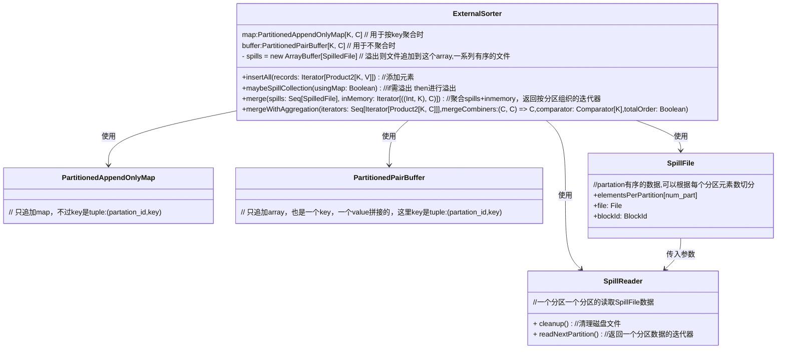

# ExternalSorter



## SpillReader

### 主要用途

`SpillReader` 类的主要用途是用于读取已经溢出到磁盘的中间文件，按顺序遍历文件中的各个分区。它被设计用于处理大规模数据，在内存不足时，将数据溢出到磁盘并能够按需从磁盘中读取。这在处理诸如大规模排序、分区、聚合等任务时非常有用，尤其是在 Spark 的 `ExternalSorter` 中，用于支持基于外部存储的排序操作。

### 使用例子

假设我们在一个 Spark 任务中需要对一个大数据集进行排序和分区操作，数据量太大，无法完全装载到内存中，因此需要使用 `ExternalSorter`。`ExternalSorter` 会将数据分批处理，当内存不够用时，会将数据溢出到磁盘。任务完成后，我们需要按分区顺序读取这些溢出的数据，`SpillReader` 就是执行此操作的工具。

下面是一个示例代码，展示如何使用 `SpillReader` 来读取数据：

```scala
// 假设我们已经通过 ExternalSorter 将数据溢出到了磁盘
val spilledFile = someExternalSorter.spillToDisk()

// 创建一个 SpillReader 来读取这个溢出的文件
val spillReader = new someExternalSorter.SpillReader(spilledFile)

// 我们希望按顺序读取每个分区的数据
while (spillReader.nextPartitionToRead < numPartitions) {
  val partitionIterator = spillReader.readNextPartition()

  // 遍历当前分区的所有 (K, C) 对
  while (partitionIterator.hasNext) {
    val (key, value) = partitionIterator.next()

    // 处理键值对
    println(s"Partition: ${spillReader.partitionId}, Key: $key, Value: $value")
  }
}

// 读取完所有分区后，调用 cleanup 来清理资源
spillReader.cleanup()
```

### 解释

- `someExternalSorter.spillToDisk()`：这会将当前存储在内存中的数据溢出到磁盘，生成一个 `SpilledFile` 对象。
- `SpillReader(spilledFile)`：使用 `SpilledFile` 创建一个 `SpillReader`，以便读取溢出到磁盘的文件。
- `readNextPartition()`：读取下一个分区的数据并返回一个迭代器，可以遍历分区内的所有 `(K, C)` 对。
- `cleanup()`：完成所有数据读取后，释放文件流等资源。

这个例子展示了 `SpillReader` 的典型用途，即在处理大数据集时，从磁盘中读取溢出的分区数据。
