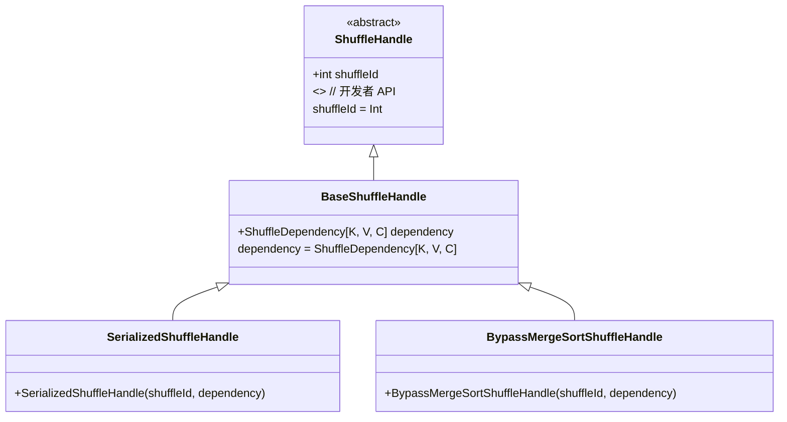

# ShuffleHandler

### 解释

- **`ShuffleHandle`** 是一个抽象类，包含一个 `shuffleId` 参数。
- **`BaseShuffleHandle`** 继承自 `ShuffleHandle`，并添加了一个 `dependency` 属性。
- **`SerializedShuffleHandle`** 和 **`BypassMergeSortShuffleHandle`** 都继承自 `BaseShuffleHandle`，用于标识不同的 shuffle 实现方式。

这个类图在 Mermaid 中展示了类之间的继承关系以及它们的主要属性和构造函数。
