# ShuffleManager

```mermaid
classDiagram
    class ShuffleManager {
        +registerShuffle(shuffleId: Int, dependency: ShuffleDependency) : ShuffleHandle // 注册一个 shuffle 操作，返回一个 ShuffleHandle
        +getWriter(handle: ShuffleHandle, mapId: Long, context: TaskContext, metrics: ShuffleWriteMetricsReporter) : ShuffleWriter // 获取一个用于写入 shuffle 数据的 ShuffleWriter
        +getReader(handle: ShuffleHandle, startPartition: Int, endPartition: Int, context: TaskContext, metrics: ShuffleReadMetricsReporter) : ShuffleReader // 获取一个用于读取 shuffle 数据的 ShuffleReader（读取所有 map 输出）
        +getReader(handle: ShuffleHandle, startMapIndex: Int, endMapIndex: Int, startPartition: Int, endPartition: Int, context: TaskContext, metrics: ShuffleReadMetricsReporter) : ShuffleReader // 获取一个用于读取 shuffle 数据的 ShuffleReader（读取指定 map 输出范围）
        +unregisterShuffle(shuffleId: Int) : Boolean // 从 ShuffleManager 中移除指定的 shuffle 元数据
        +shuffleBlockResolver: ShuffleBlockResolver // 返回一个用于检索 shuffle 数据块的 ShuffleBlockResolver
        +stop() // 停止 ShuffleManager 实例
    }

    class SortShuffleManager {
        +registerShuffle(shuffleId: Int, dependency: ShuffleDependency) : ShuffleHandle // 注册一个排序 shuffle 操作，返回一个 ShuffleHandle
        +getWriter(handle: ShuffleHandle, mapId: Long, context: TaskContext, metrics: ShuffleWriteMetricsReporter) : ShuffleWriter // 获取一个用于写入排序 shuffle 数据的 ShuffleWriter
        +getReader(handle: ShuffleHandle, startPartition: Int, endPartition: Int, context: TaskContext, metrics: ShuffleReadMetricsReporter) : ShuffleReader // 获取一个用于读取排序 shuffle 数据的 ShuffleReader（读取所有 map 输出）
        +getReader(handle: ShuffleHandle, startMapIndex: Int, endMapIndex: Int, startPartition: Int, endPartition: Int, context: TaskContext, metrics: ShuffleReadMetricsReporter) : ShuffleReader // 获取一个用于读取排序 shuffle 数据的 ShuffleReader（读取指定 map 输出范围）
        +unregisterShuffle(shuffleId: Int) : Boolean // 从 SortShuffleManager 中移除指定的排序 shuffle 元数据
        +shuffleBlockResolver: ShuffleBlockResolver // 返回一个用于检索排序 shuffle 数据块的 ShuffleBlockResolver
        +stop() // 停止 SortShuffleManager 实例
    }

    class ShuffleHandle {
        <<interface>> // 表示 shuffle 操作的标识符
    }

    class ShuffleWriter {
        <<interface>> // 用于将数据写入 shuffle 存储
    }

    class ShuffleReader {
        <<interface>> // 用于从 shuffle 存储中读取数据
    }

    class ShuffleBlockResolver {
        <<interface>> // 用于根据块坐标检索 shuffle 数据块
    }

    class ShuffleDependency {
        -shuffleId: Int // shuffle 的标识符
        -dependency: ShuffleDependency // shuffle 依赖关系
    }

    class TaskContext {
        <<interface>> // 表示任务上下文
    }

    class ShuffleWriteMetricsReporter {
        <<interface>> // 用于报告 shuffle 写入度量信息
    }

    class ShuffleReadMetricsReporter {
        <<interface>> // 用于报告 shuffle 读取度量信息
    }

    ShuffleManager --> ShuffleHandle : uses // ShuffleManager 使用 ShuffleHandle
    ShuffleManager --> ShuffleWriter : uses // ShuffleManager 使用 ShuffleWriter
    ShuffleManager --> ShuffleReader : uses // ShuffleManager 使用 ShuffleReader
    ShuffleManager --> ShuffleBlockResolver : uses // ShuffleManager 使用 ShuffleBlockResolver
    ShuffleManager --> ShuffleDependency : registers // ShuffleManager 注册 ShuffleDependency
    ShuffleWriter --> TaskContext : uses // ShuffleWriter 使用 TaskContext
    ShuffleReader --> TaskContext : uses // ShuffleReader 使用 TaskContext
    ShuffleReader --> ShuffleWriteMetricsReporter : uses // ShuffleReader 使用 ShuffleWriteMetricsReporter
    ShuffleReader --> ShuffleReadMetricsReporter : uses // ShuffleReader 使用 ShuffleReadMetricsReporter

    SortShuffleManager --> ShuffleManager : inherits // SortShuffleManager 继承 ShuffleManager
    SortShuffleManager --> ShuffleHandle : uses // SortShuffleManager 使用 ShuffleHandle
    SortShuffleManager --> ShuffleWriter : uses // SortShuffleManager 使用 ShuffleWriter
    SortShuffleManager --> ShuffleReader : uses // SortShuffleManager 使用 ShuffleReader
    SortShuffleManager --> ShuffleBlockResolver : uses // SortShuffleManager 使用 ShuffleBlockResolver
    SortShuffleManager --> ShuffleDependency : registers // SortShuffleManager 注册 ShuffleDependency
    SortShuffleManager --> TaskContext : uses // SortShuffleManager 使用 TaskContext
    SortShuffleManager --> ShuffleWriteMetricsReporter : uses // SortShuffleManager 使用 ShuffleWriteMetricsReporter
    SortShuffleManager --> ShuffleReadMetricsReporter : uses // SortShuffleManager 使用 ShuffleReadMetricsReporter
```

### 解释

1. **`ShuffleManager`**:
   - 管理 shuffle 过程，包括注册 shuffle 操作、获取读写器、卸载 shuffle 操作等。
   - 使用 `ShuffleHandle`、`ShuffleWriter` 和 `ShuffleReader`。
   - 使用 `ShuffleBlockResolver` 来检索 shuffle 数据块。

2. **`ShuffleHandle`**、**`ShuffleWriter`**、**`ShuffleReader`**、**`ShuffleBlockResolver`**:
   - 这些类或接口表示 shuffle 相关的不同组件，`ShuffleManager` 使用它们来管理 shuffle 操作。

3. **`ShuffleDependency`**:
   - 表示一个 shuffle 任务的依赖关系，用于注册 shuffle 操作。

4. **`TaskContext`**:
   - 表示任务上下文，用于传递任务执行的上下文信息。

5. **`ShuffleWriteMetricsReporter`** 和 **`ShuffleReadMetricsReporter`**:
   - 用于报告 shuffle 写入和读取的度量信息。

这个类图展示了 `ShuffleManager` 和其他 shuffle 相关组件的基本关系。你可以根据实际需要调整类的属性和方法，或者添加更多的类和关系。
