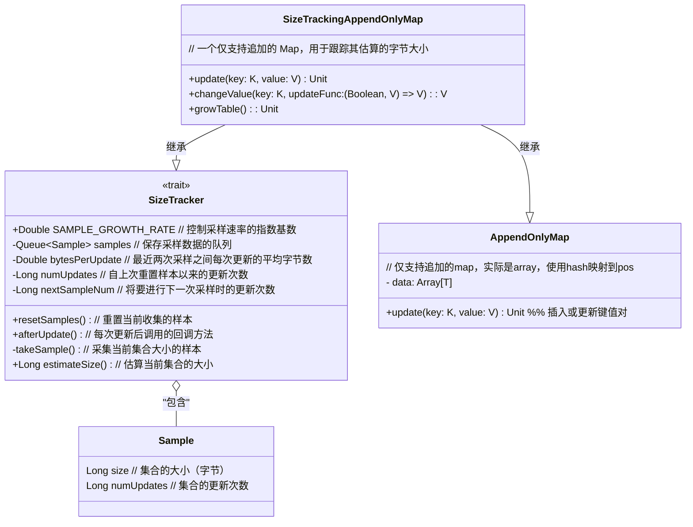
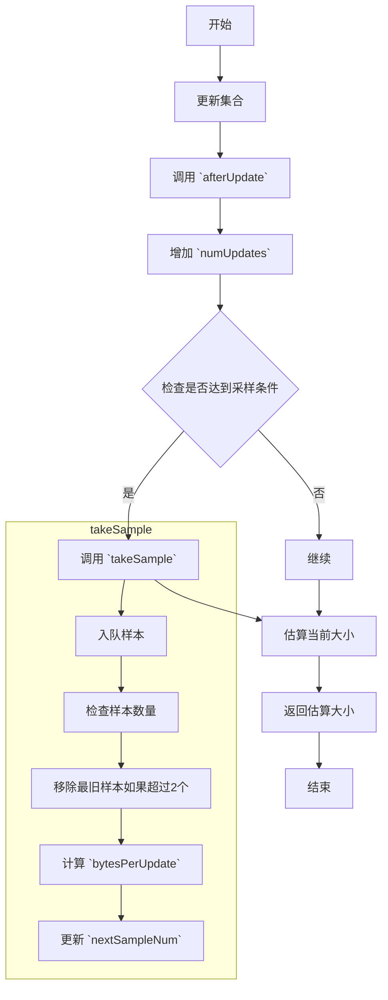

# SizeTrackingAppendOnlyMap

`SizeTrackingAppendOnlyMap` 是 Apache Spark 中用于跟踪大小的一个特殊映射（Map）数据结构。它是一个仅支持追加（append-only）的 Map，同时还会跟踪其在内存中的估计大小。这个类继承自 `AppendOnlyMap`，并实现了 `SizeTracker` 接口，以便在每次更新或扩展底层数据结构时跟踪其内存使用情况。



## SizeTracker

`SizeTracker` 是一个用于跟踪集合内存大小的通用接口，它通过采样来估计集合的大小。由于每次使用 `SizeEstimator` 进行估算的开销较大（耗时为几毫秒），因此 `SizeTracker` 采用了一种指数退避的方式来减慢采样频率，从而分摊估算的时间成本。

!!! tip tip
      SizeTracker,跟踪`this`,计算大小的步骤间隔指数衰减，对某个step，根据前面的两个sample估计当前大小。

### 核心思路

1. **指数退避采样**：通过控制 `SAMPLE_GROWTH_RATE` 来决定采样频率。初始采样发生在第 1 次更新后，接下来分别在 1.1、1.1^2、1.1^3... 次更新时采样。这样随着更新次数的增加，采样频率会逐渐降低，避免了频繁采样带来的开销。
  
2. **样本管理**：每次采样后，将样本添加到队列中，但只保留最新的两个样本。这两个样本用于推测集合在更新过程中的平均字节增长量，从而为未来的集合大小提供估计。

3. **大小估算**：在估算集合大小时，使用最近的两个样本计算平均字节增长量，并根据当前的更新次数推测出集合的当前大小。

### 主要方法

- **`resetSamples()`**：重置采样数据，这通常在集合发生重大变化后调用，重新开始采样。
- **`afterUpdate()`**：每次集合更新后都会调用此方法，记录更新次数，并在需要时进行采样。
- **`takeSample()`**：进行一次新的采样，将当前集合的大小记录为一个样本，并更新下次采样的时机。
- **`estimateSize()`**：估算集合当前的大小，基于最近的样本进行推测。

### 使用例子

假设我们有一个集合正在使用 `SizeTracker`，每当我们向集合中添加元素时，会调用 `afterUpdate()` 来记录这次操作。如果集合的更新次数达到了下一次采样的条件（由指数退避算法决定），`takeSample()` 会被调用，从而记录当前集合的大小。

当我们需要估算集合的大小时，调用 `estimateSize()` 方法。该方法会根据最近的两个样本推测当前的集合大小，而不需要重新计算所有元素的内存占用。

这个机制非常适用于那些元素数量经常变化的大型集合，它通过减少频繁的内存估算操作，显著提高了性能。



## 主要作用

`SizeTrackingAppendOnlyMap` 的主要作用是在 Spark 任务运行过程中维护键值对的同时，监控其内存使用情况。这对于 Spark 的内存管理和调度器的工作非常重要，因为 Spark 需要确保内存使用在可控范围内，避免超出内存限制引发内存溢出（OutOfMemoryError）等问题。

### 关键方法

1. **update(key: K, value: V)**:
   - 这是更新 Map 的方法，将给定的键和值插入到 Map 中。如果键已存在，则更新对应的值。
   - 在更新键值对之后，`afterUpdate()` 方法会被调用，该方法来自 `SizeTracker`，用于更新内存大小的估计。

2. **changeValue(key: K, updateFunc: (Boolean, V) => V): V**:
   - 这是一个更高级的更新方法，可以根据现有键值对的存在情况来决定如何更新值。
   - 调用该方法时会根据键的存在情况调用 `updateFunc`，然后更新 Map 并记录内存使用情况。

3. **growTable()**:
   - 这是扩展 Map 内部数据结构的方法，通常在 Map 的容量不足时调用。
   - `growTable()` 方法在扩展表后会重置样本，用于重新计算内存大小。

## 使用场景

`SizeTrackingAppendOnlyMap` 通常在 Spark 的内部被使用，而不是直接由用户在应用程序代码中使用。以下是一些可能的内部使用场景：

1. **Shuffle 阶段中的数据聚合**:
   - 当需要对数据进行聚合操作（如 `reduceByKey` 或 `aggregateByKey`）时，Spark 可能会使用类似的结构来存储中间结果，并同时监控内存使用情况，以便在内存不足时执行相应的内存管理操作（如溢写到磁盘）。

2. **缓存或检查点操作**:
   - 在 Spark 执行过程中，如果需要缓存中间数据，`SizeTrackingAppendOnlyMap` 可以用于有效管理内存，并确保在缓存数据时不会超出内存限制。

## 使用方法

虽然 `SizeTrackingAppendOnlyMap` 是一个内部类，用户通常不会直接使用，但理解它的工作原理有助于更好地理解 Spark 的内存管理和内部数据处理机制。以下是一个假设的简单示例（实际应用中不会直接使用此类）：

```scala
val map = new SizeTrackingAppendOnlyMap[String, Int]()

// 插入或更新键值对
map.update("key1", 1)
map.update("key2", 2)

// 根据条件更新键值对
map.changeValue("key1", (exists, oldValue) => if (exists) oldValue + 1 else 1)

// 当 map 需要扩展时，growTable() 方法会自动被调用
```

## 总结

`SizeTrackingAppendOnlyMap` 是 Spark 内部用于高效存储和管理键值对的 Map 结构，它不仅支持数据的追加操作，还能够在数据操作过程中持续跟踪内存使用情况。这对于优化内存管理、提高执行效率、避免内存溢出非常关键。
