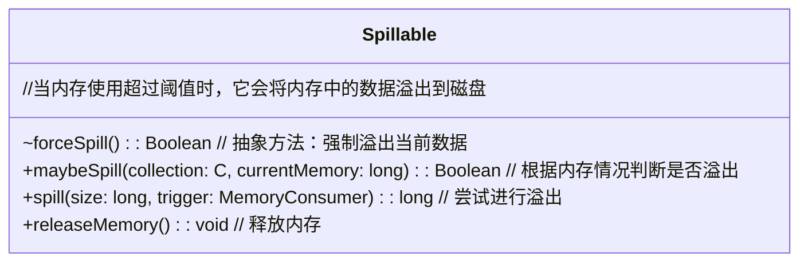
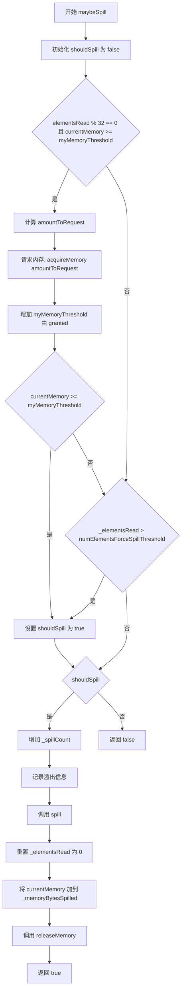

# Spillable

Spillable 是管理溢出的抽象类，

```mermaid
classDiagram
class Spillable {
    //当内存使用超过阈值时，它会将内存中的数据溢出到磁盘
    ~forceSpill(): Boolean // 抽象方法：强制溢出当前数据
    +maybeSpill(collection: C, currentMemory: long): Boolean // 根据内存情况判断是否溢出
    +spill(size: long, trigger: MemoryConsumer): long // 尝试进行溢出
    +releaseMemory(): void // 释放内存
}
```

## maybespill

上层insert数据时，会检查内存，然后发现预估的内存超过阈值就调用这个maybespill。这里每32次insert会请求扩张内存，当`扩张失败`或者`insert`数量达到临界值都会进行磁盘溢出。

```mermaid
flowchart TD
    A[开始 maybeSpill] --> B[初始化 shouldSpill 为 false]
    B --> C{elementsRead % 32 == 0 且 currentMemory >= myMemoryThreshold}
    C -->|是| D[计算 amountToRequest]
    D --> E[请求内存: acquireMemory amountToRequest]
    E --> F[增加 myMemoryThreshold 由 granted]
    F --> G{currentMemory >= myMemoryThreshold}
    C -->|否| H{_elementsRead > numElementsForceSpillThreshold}
    G -->|是| I[设置 shouldSpill 为 true]
    G -->|否| H
    H -->|是| I
    H -->|否| J{shouldSpill}
    I --> J
    J -->|是| K[增加 _spillCount]
    K --> L[记录溢出信息]
    L --> M[调用 spill]
    M --> N[重置 _elementsRead 为 0]
    N --> O[将 currentMemory 加到 _memoryBytesSpilled]
    O --> P[调用 releaseMemory]
    P --> Q[返回 true]
    J -->|否| R[返回 false]
```
