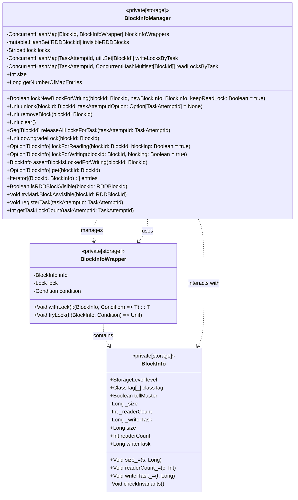

# BlockInfoManager

`BlockInfoManager` 是 Spark 的一个重要组件，负责跟踪和管理 Spark 存储系统中块的元数据，并处理块的锁定机制。它使用读写锁来确保对块的并发访问不会导致竞争条件。以下是对 `BlockInfoManager` 的详细解释：

## 主要功能

1. **块信息存储**
   - `blockInfoWrappers`: 存储每个块的元数据，使用 `ConcurrentHashMap` 进行并发安全操作。每个块的元数据由 `BlockInfoWrapper` 封装，该封装包括 `BlockInfo` 对象和一个锁 (`Lock`)。

2. **块可见性跟踪**
   - `invisibleRDDBlocks`: 记录不可见的 RDD 块。此集合用于管理块在缓存中的可见性，只有在 `trackingCacheVisibility` 启用时才会使用。

3. **锁管理**
   - `locks`: 使用 `Striped.lock` 来控制对块信息的多线程访问。每个块有一个独特的锁，这样可以避免在 `lockNewBlockForWriting` 方法中的竞争条件。
   - `writeLocksByTask`: 跟踪每个任务锁定的块的集合。
   - `readLocksByTask`: 跟踪每个任务锁定的块的集合以及锁定次数。

## 核心方法

1. **`lockForReading`**
   - 锁定一个块用于读取。如果块已经被其他任务锁定为写入，则会根据 `blocking` 参数决定是否阻塞。

2. **`lockForWriting`**
   - 锁定一个块用于写入。如果块已经被锁定为读取或写入，则会根据 `blocking` 参数决定是否阻塞。

3. **`assertBlockIsLockedForWriting`**
   - 检查当前任务是否持有写锁。如果不是，则抛出异常。

4. **`unlock`**
   - 释放块的锁。根据传入的任务尝试 ID，释放相应的读锁或写锁。

5. **`lockNewBlockForWriting`**
   - 尝试为新块获取写锁。该方法会确保第一个写入操作获得锁，而其他线程则等待或者获取读取锁。

6. **`releaseAllLocksForTask`**
   - 释放给定任务持有的所有锁，并更新全局锁计数。

7. **`removeBlock`**
   - 移除块并释放写锁。这要求在调用时必须持有写锁。

8. **`clear`**
   - 清除所有状态，通常在系统关闭时调用。

## 重要的数据结构

- **`BlockInfo`**
  - 存储每个块的基本信息，如块大小、读锁计数、写锁任务 ID 等。

- **`BlockInfoWrapper`**
  - 封装 `BlockInfo` 对象和一个锁 (`Lock`)，用于确保对块信息的线程安全操作。

- **`Striped.lock`**
  - 用于控制多线程对块信息的访问，通过为每个块分配独特的锁来减少锁竞争。

## 使用场景

- **读写操作**
  - `BlockInfoManager` 确保在读取或写入块时不会发生数据竞争。例如，多个任务可以同时读取一个块，但只有一个任务可以写入一个块。

- **任务管理**
  - 通过 `writeLocksByTask` 和 `readLocksByTask`，`BlockInfoManager` 追踪每个任务对块的操作，确保任务完成后能正确释放锁。

整体来看，`BlockInfoManager` 通过锁机制和数据结构来管理和保护块的元数据，确保 Spark 存储系统的并发安全性和有效性。
