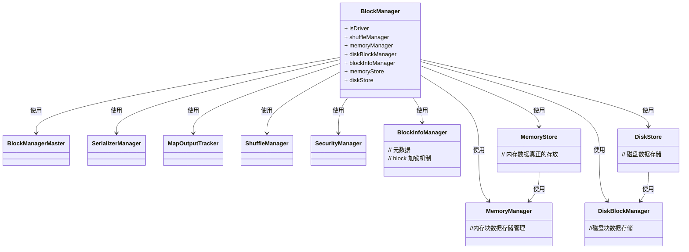

# BlockManager

```mermaid
classDiagram
    class BlockManager {
        + isDriver
        + shuffleManager
        + memoryManager
        + diskBlockManager
        + blockInfoManager
        + memoryStore
        + diskStore

    }
    BlockManager --> BlockManagerMaster : 使用
    BlockManager --> SerializerManager : 使用
    BlockManager --> MemoryManager : 使用
    BlockManager --> MapOutputTracker : 使用
    BlockManager --> ShuffleManager : 使用
    BlockManager --> SecurityManager : 使用
    BlockManager --> BlockInfoManager : 使用
    BlockManager --> DiskBlockManager : 使用
    BlockManager --> MemoryStore : 使用
    BlockManager --> DiskStore : 使用

    DiskStore --> DiskBlockManager:使用
    MemoryStore --> MemoryManager :使用
    class BlockManagerMaster{

    }
    class SerializerManager {

    }
    
    class  MemoryManager {
        //内存块数据存储管理
    }
    class DiskBlockManager {
        //磁盘块数据存储
    }

    class MapOutputTracker {

    }

    class ShuffleManager {

    }
    class SecurityManager {

    }

    class BlockInfoManager {
        // 元数据
        // block 加锁机制
    }
    class MemoryStore {
        // 内存数据真正的存放
    }
    class DiskStore {
        // 磁盘数据存储
    }

    
```
