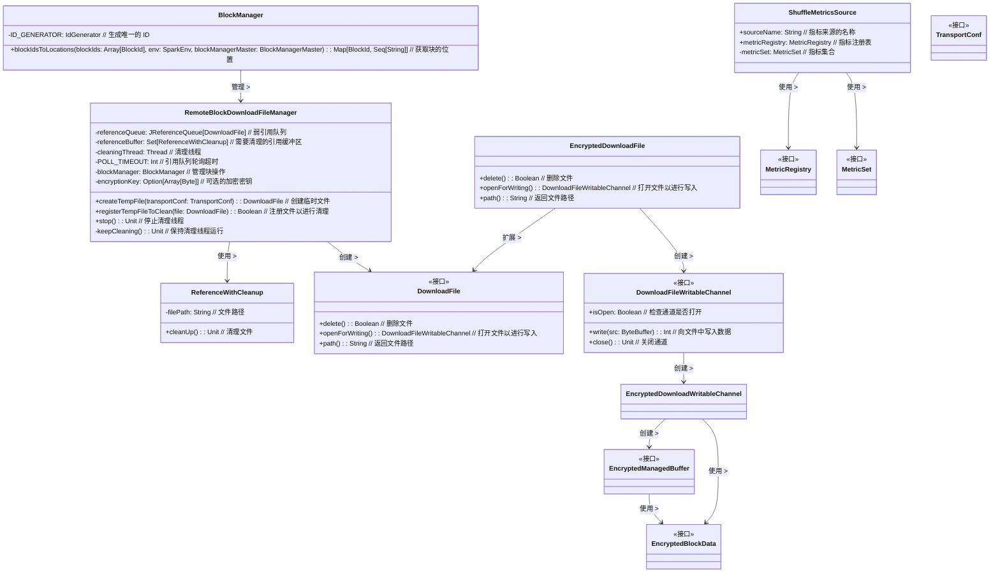

# BlockManager

`BlockManager` 是 Apache Spark 中的一个重要组件，主要负责管理和处理 Spark 中的内存和磁盘中的数据块。以下是 `BlockManager` 的主要功能、方法和用途：

1. **数据块的存储与管理**：
   - `BlockManager` 负责将数据块（如 RDD 分区或广播变量）存储在内存或磁盘上，并提供对这些数据块的访问。

2. **数据块的位置查询**：
   - 它能够查询特定数据块的位置，并确定这些数据块存储在哪些节点上。

3. **数据块的复制与迁移**：
   - 支持将数据块从一个节点迁移到另一个节点，并进行数据块的复制，以提高容错能力和数据可用性。

4. **数据块的清理**：
   - 负责清理不再使用的数据块，释放存储空间。

## 主要方法

1. **`blockIdsToLocations`**：
   - **功能**：获取给定 `blockIds` 的块的位置。
   - **参数**：
     - `blockIds`：要查询的块 ID 数组。
     - `env`：`SparkEnv` 对象，包含执行环境的信息。
     - `blockManagerMaster`：可选的 `BlockManagerMaster` 对象，用于在测试中使用。
   - **返回值**：一个映射，表示每个块 ID 对应的存储位置列表。

2. **`ID_GENERATOR`**：
   - **功能**：用于生成唯一的 ID。这个成员通常是一个私有的静态变量，用于为数据块分配唯一标识符。

### 主要用途

- **数据存储与访问**：
  `BlockManager` 是 Spark 中数据存储和访问的核心组件，负责将数据存储在内存中以实现快速访问，或者在磁盘上以保证数据的持久性。

- **数据块的管理**：
  在执行任务时，`BlockManager` 负责管理数据块的生命周期，包括创建、更新、访问和删除数据块。它确保数据块在不同的执行环境和节点之间一致，并能高效地进行数据块的调度和移动。

- **容错与负载均衡**：
  `BlockManager` 通过数据块的复制和迁移实现容错。它支持将数据块从一个节点迁移到另一个节点，以实现负载均衡和提高系统的可靠性。

