# BlockManager

`BlockManager` 是 Apache Spark 中的一个重要组件，主要负责管理和处理 Spark 中的内存和磁盘中的数据块。以下是 `BlockManager` 的主要功能、方法和用途：

1. **数据块的存储与管理**：
   - `BlockManager` 负责将数据块（如 RDD 分区或广播变量）存储在内存或磁盘上，并提供对这些数据块的访问。

2. **数据块的位置查询**：
   - 它能够查询特定数据块的位置，并确定这些数据块存储在哪些节点上。

3. **数据块的复制与迁移**：
   - 支持将数据块从一个节点迁移到另一个节点，并进行数据块的复制，以提高容错能力和数据可用性。

4. **数据块的清理**：
   - 负责清理不再使用的数据块，释放存储空间。

## 主要方法

1. **`blockIdsToLocations`**：
   - **功能**：获取给定 `blockIds` 的块的位置。
   - **参数**：
     - `blockIds`：要查询的块 ID 数组。
     - `env`：`SparkEnv` 对象，包含执行环境的信息。
     - `blockManagerMaster`：可选的 `BlockManagerMaster` 对象，用于在测试中使用。
   - **返回值**：一个映射，表示每个块 ID 对应的存储位置列表。

2. **`ID_GENERATOR`**：
   - **功能**：用于生成唯一的 ID。这个成员通常是一个私有的静态变量，用于为数据块分配唯一标识符。

### 主要用途

- **数据存储与访问**：
  `BlockManager` 是 Spark 中数据存储和访问的核心组件，负责将数据存储在内存中以实现快速访问，或者在磁盘上以保证数据的持久性。

- **数据块的管理**：
  在执行任务时，`BlockManager` 负责管理数据块的生命周期，包括创建、更新、访问和删除数据块。它确保数据块在不同的执行环境和节点之间一致，并能高效地进行数据块的调度和移动。

- **容错与负载均衡**：
  `BlockManager` 通过数据块的复制和迁移实现容错。它支持将数据块从一个节点迁移到另一个节点，以实现负载均衡和提高系统的可靠性。

由于代码量较大，我将提供`BlockManager`类及其一些关键相关类的类图，并包含部分成员和方法的注释。请注意，由于Mermaid的限制和代码复杂性，我不能展示整个类的所有成员和方法，但以下是一个更为详细的示例：

```mermaid
classDiagram
    class BlockManager {
        -executorId: String
        -rpcEnv: RpcEnv
        -master: BlockManagerMaster
        -serializerManager: SerializerManager
        -conf: SparkConf
        _memoryManager: MemoryManager
        mapOutputTracker: MapOutputTracker
        _shuffleManager: ShuffleManager
        blockTransferService: BlockTransferService
        securityManager: SecurityManager
        externalBlockStoreClient: Option[ExternalBlockStoreClient]
        +initialize(appId: String): Unit
        +getLocalBlockData(blockId: BlockId): ManagedBuffer
        +putBlockData(blockId: BlockId, data: ManagedBuffer, level: StorageLevel, classTag: ClassTag[_]): Boolean
        +getLocalValues(blockId: BlockId): Option[BlockResult]
        +getRemoteValues[T: ClassTag](blockId: BlockId): Option[BlockResult]
        +stop(): Unit
        // 管理内存和磁盘存储，提供块的存取接口
    }
    class BlockDataManager {
        // 管理块数据的接口
        +...更多方法和字段...
    }
    class BlockEvictionHandler {
        // 处理块的逐出逻辑
        +...方法和字段...
    }
    class MemoryStore {
        -conf: SparkConf
        -blockInfoManager: BlockInfoManager
        -serializerManager: SerializerManager
        -memoryManager: MemoryManager
        -blockManager: BlockManager
        +putBytes(blockId: BlockId, bytes: ChunkedByteBuffer, memoryMode: MemoryMode): Boolean
        +...更多方法和字段...
        // 管理内存中的块存储
    }
    class DiskBlockManager {
        -conf: SparkConf
        -deleteFilesOnStop: Boolean
        -isDriver: Boolean
        +getLocalDirs: Array[String]
        +...更多方法和字段...
        // 管理磁盘上的块存储
    }
    class BlockInfoManager {
        +lockForWriting(blockId: BlockId): BlockInfo
        +unlock(blockId: BlockId)
        +...更多方法和字段...
        // 管理块信息和锁
    }
    class BlockTransferService {
        +fetchBlockSync(host: String, port: Int, execId: String, blockId: String): ManagedBuffer
        +uploadBlockSync(...)
        // 负责块数据的传输
    }
    class SerializerManager {
        +dataSerializeStream(...)
        +dataDeserializeStream(...)
        // 管理序列化和反序列化逻辑
    }
    class ShuffleManager {
        +shuffleBlockResolver: ShuffleBlockResolver
        // 管理Shuffle过程中的块
    }
    class SecurityManager {
        +getIOEncryptionKey(): Option[Array[Byte]]
        // 管理安全相关的设置，例如加密
    }
    class ExternalBlockStoreClient {
        +init(appId: String)
        +...更多方法和字段...
        // 外部块存储的客户端
    }
    class RpcEnv {
        +...方法和字段...
        // RPC环境
    }
    class SparkConf {
        +...方法和字段...
        // Spark配置信息
    }

    BlockManager --|> BlockDataManager: "Composition"
    BlockManager --|> BlockEvictionHandler: "Composition"
    MemoryStore o-- BlockManager: "Association"
    DiskBlockManager o-- BlockManager: "Association"
    BlockInfoManager o-- BlockManager: "Association"
    BlockTransferService o-- BlockManager: "Association"
    SerializerManager o-- BlockManager: "Association"
    ShuffleManager o-- BlockManager: "Association"
    SecurityManager o-- BlockManager: "Association"
    ExternalBlockStoreClient o-- BlockManager: "Association"
    RpcEnv o-- BlockManager: "Association"
    SparkConf o-- BlockManager: "Association"
```

请注意，这个类图仅展示了部分成员变量和方法，并且每个类的主要职责。实际的类可能包含更多的细节和复杂性。此外，由于Mermaid类图的文本限制，可能需要进一步简化或拆分类图以适应特定的显示需求。

以下是带有注释的 Mermaid 类图，展示了成员变量和方法后的注释：

以下是代码中主要功能和方法的详细解释：

### 1. **BlockData 接口**

   **主要功能**:
   `BlockData` 接口定义了一组操作块数据的通用方法，抽象了如何存储和读取块数据，主要应用于 Spark 的存储系统中。

   **主要方法**:

- `toInputStream(): InputStream`  
     **功能**: 将块数据转换为 `InputStream`，方便进行流式处理。
- `toNetty(): Object`  
     **功能**: 将块数据转换为 Netty 友好的对象，用于网络传输。
- `toNettyForSsl(): Object`  
     **功能**: 将块数据转换为支持 SSL 的 Netty 对象，用于安全传输。
- `toChunkedByteBuffer(allocator: Int => ByteBuffer): ChunkedByteBuffer`  
     **功能**: 将块数据转换为 `ChunkedByteBuffer`，用于处理大块的字节数据。
- `toByteBuffer(): ByteBuffer`  
     **功能**: 将块数据转换为 `ByteBuffer`，用于字节缓冲处理。
- `size: Long`  
     **功能**: 返回块数据的大小，以字节为单位。
- `dispose(): Unit`  
     **功能**: 释放块数据相关的资源，防止内存泄漏。

### 2. **ByteBufferBlockData 类**

   **主要功能**:
   `ByteBufferBlockData` 类是 `BlockData` 接口的一个实现，用于处理基于 `ChunkedByteBuffer` 的块数据。它提供了具体的实现来转换和处理块数据，并在必要时释放资源。

   **主要方法**:

- `toInputStream(): InputStream`  
     **功能**: 将 `ChunkedByteBuffer` 转换为 `InputStream`，以便读取数据。
- `toNetty(): Object`  
     **功能**: 将 `ChunkedByteBuffer` 转换为 Netty 友好的对象。
- `toNettyForSsl(): Object`  
     **功能**: 将 `ChunkedByteBuffer` 转换为支持 SSL 的 Netty 对象。
- `toChunkedByteBuffer(allocator: Int => ByteBuffer): ChunkedByteBuffer`  
     **功能**: 复制并返回一个新的 `ChunkedByteBuffer` 对象。
- `toByteBuffer(): ByteBuffer`  
     **功能**: 将 `ChunkedByteBuffer` 转换为单一的 `ByteBuffer`。
- `size: Long`  
     **功能**: 返回缓冲区的总字节大小。
- `dispose(): Unit`  
     **功能**: 如果 `shouldDispose` 标志为 `true`，则释放缓冲区资源。

### 3. **BlockResult 类**

   **主要功能**:
   `BlockResult` 类用于存储块数据的读取结果，包括数据本身、读取方法和数据大小。它是一个简单的容器类，用于封装块数据读取后的返回值。

   **主要方法**:

- `data: Iterator[Any]`  
     **功能**: 块数据的迭代器，用于遍历读取的数据项。
- `readMethod: DataReadMethod.Value`  
     **功能**: 指示读取数据的方法，可能是从磁盘、内存或网络中读取。
- `bytes: Long`  
     **功能**: 记录读取数据的字节数，用于统计或性能分析。

### 4. **HostLocalDirManager 类**

   **主要功能**:
   `HostLocalDirManager` 类用于管理 Spark 集群中本地目录的缓存。这些本地目录通常用于存储执行器的临时数据，类中提供了获取和缓存这些目录的功能。

   **主要方法**:

- `getCachedHostLocalDirs(): Map[String, Array[String]]`  
     **功能**: 返回当前缓存的执行器本地目录，以 `Map` 的形式返回执行器 ID 和其对应的本地目录数组。
- `getCachedHostLocalDirsFor(executorId: String): Option[Array[String]]`  
     **功能**: 根据指定的执行器 ID，获取其缓存的本地目录。如果缓存中没有该执行器的目录，返回 `None`。
- `getHostLocalDirs(host: String, port: Int, executorIds: Array[String], callback: Try[Map[String, Array[String]]] => Unit): Unit`  
     **功能**: 通过网络请求从远程获取指定主机和执行器的本地目录，并在获取后调用回调函数处理结果。成功时缓存结果，失败时返回错误。

这些类和接口在 Spark 的存储系统中扮演着重要角色，负责数据的存储、读取和管理，确保数据处理的高效性和可靠性。

