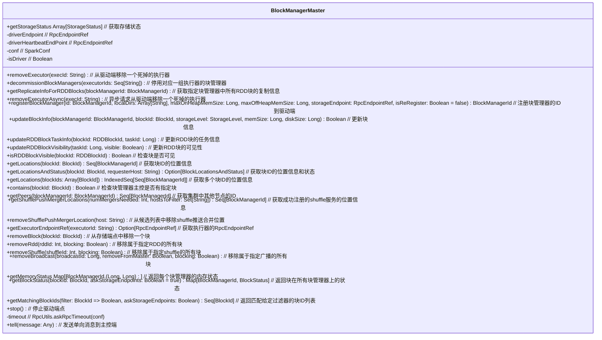

# BlockManagerMaster

`BlockManagerMaster` 类是 Apache Spark 的一个内部组件，用于在集群中管理和协调块管理器（Block Manager）。它负责以下主要功能：

1. **块管理器的注册与管理**：
   - **`registerBlockManager`**：注册一个新的块管理器到驱动端，获取块管理器的完整信息，包括拓扑信息。
   - **`removeExecutor`** 和 **`removeExecutorAsync`**：从驱动端移除死掉的执行器，并可以选择异步操作。

2. **块和数据的管理**：
   - **`updateBlockInfo`**：更新块的信息，包括存储级别、内存大小和磁盘大小。
   - **`removeBlock`**：从所有存储端点中移除指定的块。
   - **`removeRdd`**、**`removeShuffle`** 和 **`removeBroadcast`**：移除指定的RDD、shuffle或广播相关的所有块。

3. **块的可见性和状态**：
   - **`isRDDBlockVisible`**：检查RDD块是否可见。
   - **`getBlockStatus`**：获取块在所有块管理器上的状态，包括可能的未来状态。
   - **`getLocations`** 和 **`getLocationsAndStatus`**：获取块的位置信息和状态。

4. **集群状态和配置**：
   - **`getMemoryStatus`** 和 **`getStorageStatus`**：获取块管理器的内存和存储状态。
   - **`getPeers`**：获取集群中其他块管理器的ID。
   - **`getShufflePushMergerLocations`** 和 **`removeShufflePushMergerLocation`**：管理shuffle推送合并的位置。

5. **其他功能**：
   - **`stop`**：停止驱动端点，通常在驱动程序停止时调用。
   - **`getExecutorEndpointRef`**：获取指定执行器的RPC端点引用。

这个类的主要作用是通过 RPC（远程过程调用）与集群中的块管理器进行通信，管理块的存储、状态更新、内存和其他相关操作，确保 Spark 的数据处理任务能够高效地运行。

