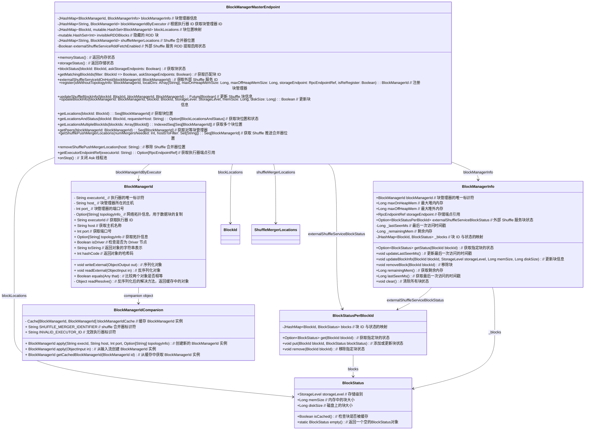

# BlockManager状态追踪

## BlockManagerMasterEndpoint

**功能概述**:
`BlockManagerMasterEndpoint` 是一个用于在 Spark 集群的主节点上追踪所有存储端点的 BlockManager 状态的类。它主要用于管理和协调集群中各个 BlockManager 的块存储和状态信息。

**主要方法及使用**:

- **`receiveAndReply(context: RpcCallContext)`**: 处理不同类型的 RPC 消息，并根据请求执行相应的操作。主要处理注册 BlockManager、更新块信息、获取块位置、获取内存状态等。
- **`isRDDBlockVisible(blockId: RDDBlockId)`**: 检查给定 RDD 块的可见性。
- **`updateRDDBlockVisibility(taskId: Long, visible: Boolean)`**: 更新 RDD 块的可见性状态。
- **`removeRdd(rddId: Int)`**: 删除指定 RDD 的所有块，包括从存储端点和外部 Shuffle 服务中删除。
- **`removeShuffle(shuffleId: Int)`**: 删除指定 Shuffle 的所有块，处理相关的块删除操作。

**使用示例**:

- 注册 BlockManager 时，通过 `RegisterBlockManager` 消息发送注册请求。
- 更新块信息时，通过 `UpdateBlockInfo` 消息发送更新请求。
- 获取块位置时，通过 `GetLocations` 消息查询块位置。
- 删除 RDD 时，调用 `removeRdd` 方法来删除相关的块。

该类在 Spark 的 BlockManager 管理和集群调度中扮演了重要的角色，确保了块的正确存储、更新和删除操作。

## `BlockStatus` 类

- **功能**：表示块的存储状态，包括内存和磁盘中的大小。
- **主要方法**：
  
  - `isCached`: 判断块是否被缓存（即是否在内存或磁盘中有数据）。
- **用法**：
  
  ```scala
  val status = BlockStatus(StorageLevel.MEMORY_ONLY, 1024L, 0L)
  val cached = status.isCached  // 返回 true，因为内存大小大于 0
  ```

### `BlockStatusPerBlockId` 类

- **功能**：管理块状态的映射，并在所有块被移除时清空内存。
- **主要方法**：
  
  - `get(blockId: BlockId)`: 获取指定块的状态。
  - `put(blockId: BlockId, blockStatus: BlockStatus)`: 添加或更新块的状态。
  - `remove(blockId: BlockId)`: 移除指定块的状态。
- **用法**：
  
  ```scala
  val blockStatusMap = new BlockStatusPerBlockId
  blockStatusMap.put(blockId, BlockStatus(StorageLevel.MEMORY_ONLY, 1024L, 0L))
  val status = blockStatusMap.get(blockId)
  blockStatusMap.remove(blockId)
  ```

### `BlockManagerInfo` 类

- **功能**：跟踪块管理器的信息，包括内存使用情况和块状态。
- **主要方法**：
  
  - `getStatus(blockId: BlockId)`: 获取指定块的状态。
  - `updateBlockInfo(blockId: BlockId, storageLevel: StorageLevel, memSize: Long, diskSize: Long)`: 更新块的状态信息。
  - `removeBlock(blockId: BlockId)`: 移除指定块的状态。
  - `remainingMem`: 返回剩余的内存大小。
- **用法**：
  
  ```scala
  val managerInfo = new BlockManagerInfo(...)
  managerInfo.updateBlockInfo(blockId, StorageLevel.MEMORY_ONLY, 1024L, 0L)
  val status = managerInfo.getStatus(blockId)
  val freeMemory = managerInfo.remainingMem
  managerInfo.removeBlock(blockId)
  ```


