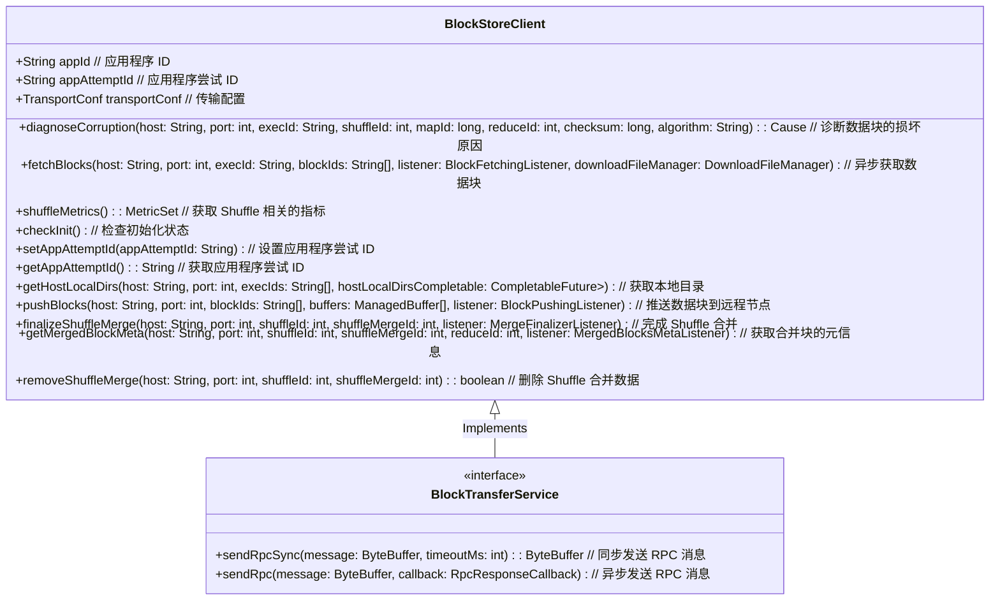

# BlockTrans

`BlockTransferService` 类主要负责在 Spark 集群中传输块数据（blocks），同时包含了客户端和服务器端的功能。核心功能包括初始化服务、上传块数据到远程节点、同步和异步获取块数据等。

好的！以下是带有中文注释的 `BlockStoreClient` 和 `BlockTransferService` 的 Mermaid 类图表示。

### 图解说明

1. **`BlockStoreClient`** 类的每个成员都带有中文注释，解释了它们的功能和用途。
2. **`BlockTransferService`** 接口也添加了中文注释，描述了其方法的作用。

这些注释可以帮助理解每个方法和字段的具体功能。
