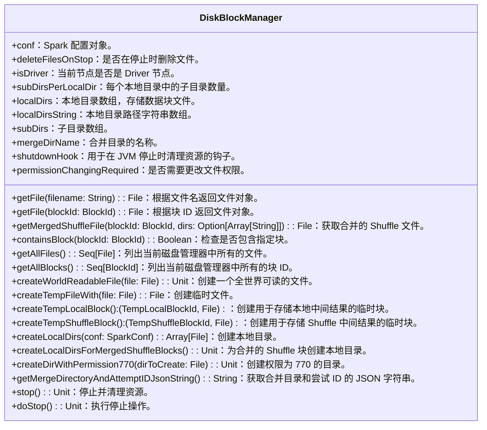

# DiskBlockManager

`DiskBlockManager` 类负责在磁盘上管理数据块的存储和检索。下面是对这个类的详细分析：

## 类定义

`DiskBlockManager` 类是私有的（`private[spark]`），用于管理数据块与磁盘上实际存储位置之间的逻辑映射。主要职责包括：

- 创建和维护本地目录以存储数据块文件。
- 提供在这些目录中查找和存储文件的方法。
- 处理文件和目录的权限问题，确保安全性和可访问性。



### 构造函数和字段

```scala
class DiskBlockManager(
    conf: SparkConf,
    var deleteFilesOnStop: Boolean,
    isDriver: Boolean)
  extends Logging
```

### 内部对象

`DiskBlockManager` 伴生对象定义了一些常量：

- `MERGE_DIRECTORY`：合并目录名称。
- `MERGE_DIR_KEY`：合并目录键。
- `ATTEMPT_ID_KEY`：尝试 ID 键。

### 关键点

- **文件和目录管理**：通过创建多个子目录来避免顶级目录中的 inode 过大问题。
- **权限管理**：根据配置改变文件和目录的权限，确保 Shuffle 服务在安全环境中能够删除文件。
- **高可用性和容错性**：在失败时能够安全退出，并在创建目录时处理异常情况。
- **整合外部 Shuffle 服务**：与外部 Shuffle 服务集成，确保文件在安全环境中可访问。

这个类在 Spark 的数据块管理中起到了关键作用，确保了数据在磁盘上的高效、安全存储和访问。

`localDirs` 和 `subDirs` 是 `DiskBlockManager` 中用于管理本地存储目录和子目录的两个关键变量。它们用于存储 Spark 中的块数据，以避免单个目录中的 inode 过多而导致性能下降。

### `localDirs`

`localDirs` 是一个 `Array[File]`，表示所有配置的本地目录。这些目录用于存储数据块。Spark 会从配置中读取本地目录路径，并为每个路径创建一个目录。如果所有目录创建失败，Spark 会记录错误并退出。

```scala
private[spark] val localDirs: Array[File] = createLocalDirs(conf)
if (localDirs.isEmpty) {
  logError("Failed to create any local dir.")
  System.exit(ExecutorExitCode.DISK_STORE_FAILED_TO_CREATE_DIR)
}
```

### `subDirs`

`subDirs` 是一个二维数组 `Array[Array[File]]`，表示每个本地目录中的**子目录**。通过将文件分散到多个子目录中，可以避免单个目录中包含过多文件而导致的性能问题。`subDirs` 的每个元素都是一个 `Array[File]`，这些数组的长度等于配置的子目录数量。

!!! note local.dir与subDirs的关系示例
    假设有以下配置：
    - spark.local.dir 包含两个路径：/data/spark1 和 /data/spark2
    - subDirsPerLocalDir 设置为 64
    在这种情况下，localDirs 数组将包含两个目录，而 subDirs 将是一个二维数组，每个元素都是一个长度为 64 的 Array[File]。
    ```scala
    private val subDirs = Array.fill(localDirs.length)(new Array[File](subDirsPerLocalDir))
    Array(
    Array(null, null, ..., null), // 64 个 null
    Array(null, null, ..., null)  // 64 个 null
    )
    ```

### 文件存储示例

假设有一个文件 `block123`，通过哈希计算将其存储在合适的子目录中：

```scala
def getFile(filename: String): File = {
  val hash = Utils.nonNegativeHash(filename)
  val dirId = hash % localDirs.length
  val subDirId = (hash / localDirs.length) % subDirsPerLocalDir

  // 创建子目录（如果尚未创建）
  val subDir = subDirs(dirId).synchronized {
    val old = subDirs(dirId)(subDirId)
    if (old != null) {
      old
    } else {
      val newDir = new File(localDirs(dirId), "%02x".format(subDirId))
      if (!newDir.exists()) {
        newDir.mkdirs()
      }
      subDirs(dirId)(subDirId) = newDir
      newDir
    }
  }

  new File(subDir, filename)
}

val file = getFile("block123")
println(file) // 例如：/data/spark1/00/block123
```

### Block vs fileName

可以根据文件名或者blockId获取文件,具体的，若通过blockId,如下代码所示，实际上仍然是通过文件名获取文件

```scala
  def containsBlock(blockId: BlockId): Boolean = {
    getFile(blockId.name).exists()
  }
```

### 总结

`localDirs` 和 `subDirs` 用于管理数据块的存储目录，通过将数据块分散到多个子目录中，可以提高性能并避免单个目录中过多文件的问题。这种设计使得 Spark 在处理大规模数据时能够更有效地管理存储资源。
