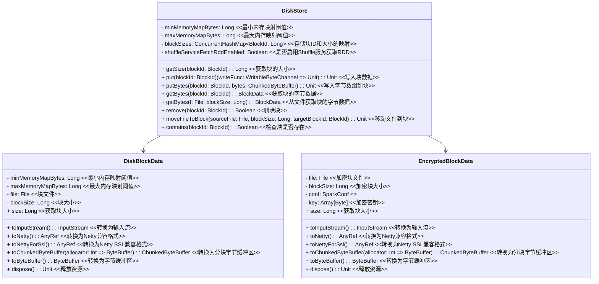

# DiskStore

`DiskStore` 类实现了 Spark 中的块管理器，用于在磁盘上存储块（block）。下面是对关键部分的解释和分析：

## 类图



## DiskStore 类

`DiskStore` 负责将块写入磁盘，并提供读取和删除这些块的方法。它使用 `DiskBlockManager` 来管理磁盘文件，并支持加密块的处理。该类还跟踪每个块的大小。

### 属性

- `minMemoryMapBytes`: 最小内存映射阈值。
- `maxMemoryMapBytes`: 最大内存映射限制。
- `blockSizes`: 用于存储每个块大小的并发哈希表。
- `shuffleServiceFetchRddEnabled`: 标识是否启用了从 shuffle 服务获取 RDD 的功能。

### 方法

- `getSize(blockId: BlockId)`: 获取指定块的大小。
- `put(blockId: BlockId)(writeFunc: WritableByteChannel => Unit)`: 将块写入磁盘。如果块已经存在，则会先删除旧块。
- `putBytes(blockId: BlockId, bytes: ChunkedByteBuffer)`: 将 `ChunkedByteBuffer` 写入磁盘。
- `getBytes(blockId: BlockId)`: 读取指定块的数据。
- `remove(blockId: BlockId)`: 删除指定块。
- `moveFileToBlock(sourceFile: File, blockSize: Long, targetBlockId: BlockId)`: 将源文件移动到目标块。
- `contains(blockId: BlockId)`: 检查块是否存在。

## 关键实现

### `put` 方法

负责将块写入磁盘。首先检查块是否已经存在，如果存在则删除旧块。然后使用 `writeFunc` 将数据写入磁盘，并记录块的大小。

```scala
def put(blockId: BlockId)(writeFunc: WritableByteChannel => Unit): Unit = {
  if (contains(blockId)) {
    logWarning(log"Block ${MDC(BLOCK_ID, blockId)} is already present in the disk store")
    try {
      diskManager.getFile(blockId).delete()
    } catch {
      case e: Exception =>
        throw SparkException.internalError(
          s"Block $blockId is already present in the disk store and could not delete it $e",
          category = "STORAGE")
    }
  }
  logDebug(s"Attempting to put block $blockId")
  val startTimeNs = System.nanoTime()
  val file = diskManager.getFile(blockId)

  if (shuffleServiceFetchRddEnabled) {
    diskManager.createWorldReadableFile(file)
  }
  val out = new CountingWritableChannel(openForWrite(file)) // 打开的文件句柄
  var threwException: Boolean = true
  try {
    writeFunc(out)//回调函数，写入数据到out
    blockSizes.put(blockId, out.getCount)
    threwException = false
  } finally {
    try {
      out.close()
    } catch {
      case ioe: IOException =>
        if (!threwException) {
          threwException = true
          throw ioe
        }
    } finally {
       if (threwException) {
        remove(blockId)
      }
    }
  }
  logDebug(s"Block ${file.getName} stored as ${Utils.bytesToString(file.length())} file" +
    s" on disk in ${TimeUnit.NANOSECONDS.toMillis(System.nanoTime() - startTimeNs)} ms")
}
```

### `getBytes` 方法

读取块数据。根据是否启用了加密，选择不同的实现。

```scala
def getBytes(blockId: BlockId): BlockData = {
  getBytes(diskManager.getFile(blockId.name), getSize(blockId))
}

def getBytes(f: File, blockSize: Long): BlockData = securityManager.getIOEncryptionKey() match {
  case Some(key) =>
    new EncryptedBlockData(f, blockSize, conf, key)
  case _ =>
    new DiskBlockData(minMemoryMapBytes, maxMemoryMapBytes, f, blockSize)
}
```

### `remove` 方法

删除块。

```scala
def remove(blockId: BlockId): Boolean = {
  blockSizes.remove(blockId)
  val file = diskManager.getFile(blockId.name)
  if (file.exists()) {
    val ret = file.delete()
    if (!ret) {
      logWarning(log"Error deleting ${MDC(PATH, file.getPath())}")
    }
    ret
  } else {
    false
  }
}
```

## 辅助类

### `DiskBlockData`

处理非加密的块数据，包括从磁盘读取数据和将数据转换为各种格式。

### `EncryptedBlockData`

处理加密的块数据。

### `CountingWritableChannel`

包装 `WritableByteChannel`，用于记录写入的数据量。

## 示例代码

以下是如何使用 `DiskStore` 类的示例：

```scala
val conf = new SparkConf()
val diskManager = new DiskBlockManager(conf, null)
val securityManager = new SecurityManager(conf)

val diskStore = new DiskStore(conf, diskManager, securityManager)

// 写入数据
val blockId = new RDDBlockId(1, 0)
val data = "Hello, Spark!".getBytes()
diskStore.put(blockId) { channel =>
  channel.write(ByteBuffer.wrap(data))
}

// 读取数据
val blockData = diskStore.getBytes(blockId)
val inputStream = blockData.toInputStream()
val result = new Array[Byte](data.length)
inputStream.read(result)
println(new String(result)) // 输出: Hello, Spark!

// 删除数据
diskStore.remove(blockId)
```

这段代码展示了如何使用 `DiskStore` 类写入、读取和删除块数据。
