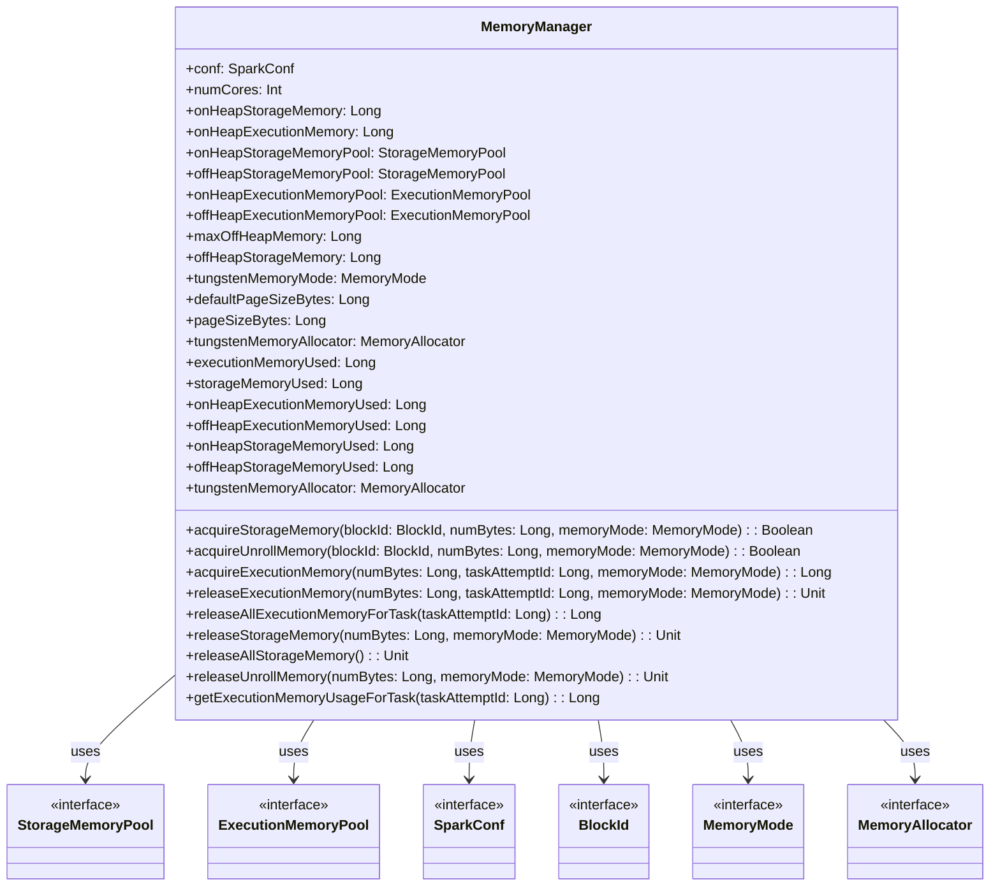

# MemoryManager

## `MemoryManager` 类解析

`MemoryManager` 类是 Spark 内存管理的抽象基类，负责在执行内存和存储内存之间分配和管理内存。它使用 `StorageMemoryPool` 和 `ExecutionMemoryPool` 来管理不同类型的内存池，并根据配置来处理堆内存和非堆内存的使用。

### 主要字段和方法

1. **字段**

   - `onHeapStorageMemoryPool` 和 `offHeapStorageMemoryPool`
     - `StorageMemoryPool` 的实例，用于管理堆内存和非堆内存中的存储内存。

   - `onHeapExecutionMemoryPool` 和 `offHeapExecutionMemoryPool`
     - `ExecutionMemoryPool` 的实例，用于管理堆内存和非堆内存中的执行内存。

   - `maxOffHeapMemory`
     - 最大的非堆内存大小。

   - `offHeapStorageMemory`
     - 分配给存储的非堆内存大小。

   - `tungstenMemoryMode`
     - 指示 Tungsten 内存分配是使用堆内存还是非堆内存。

   - `defaultPageSizeBytes`
     - 默认的页面大小。

   - `pageSizeBytes`
     - 配置的页面大小。

   - `tungstenMemoryAllocator`
     - 用于 Tungsten 内存的分配器。

2. **方法**

   - `acquireStorageMemory`
     - 请求存储内存，必要时会回收已有内存。

   - `acquireUnrollMemory`
     - 请求解压内存，允许子类区分存储内存和解压内存的行为。

   - `acquireExecutionMemory`
     - 请求执行内存，用于当前任务。

   - `releaseExecutionMemory`
     - 释放执行内存。

   - `releaseAllExecutionMemoryForTask`
     - 释放所有执行内存。

   - `releaseStorageMemory`
     - 释放存储内存。

   - `releaseAllStorageMemory`
     - 释放所有存储内存。

   - `releaseUnrollMemory`
     - 释放解压内存。

   - `executionMemoryUsed` 和 `storageMemoryUsed`
     - 获取当前使用的执行内存和存储内存。

   - `getExecutionMemoryUsageForTask`
     - 获取给定任务的执行内存使用情况。

   - `tungstenMemoryAllocator`
     - 根据内存模式选择合适的内存分配器。

### `Mermaid` 图表

以下是 `MemoryManager` 类的 `Mermaid` 图表，展示了主要字段和方法的关系及其注释。

### 注释说明

- **字段**
  - `onHeapStorageMemoryPool` 和 `offHeapStorageMemoryPool` 负责管理存储内存的堆和非堆内存。
  - `onHeapExecutionMemoryPool` 和 `offHeapExecutionMemoryPool` 负责管理执行内存的堆和非堆内存。
  - `maxOffHeapMemory` 和 `offHeapStorageMemory` 用于配置和管理非堆内存的使用。
  - `tungstenMemoryMode` 决定了内存是使用堆内存还是非堆内存。
  - `defaultPageSizeBytes` 和 `pageSizeBytes` 确定页面的默认大小。

- **方法**
  - `acquireStorageMemory` 和 `acquireUnrollMemory` 用于请求存储和解压内存。
  - `acquireExecutionMemory` 用于请求执行内存。
  - `releaseExecutionMemory` 和 `releaseStorageMemory` 用于释放内存。
  - `executionMemoryUsed` 和 `storageMemoryUsed` 提供当前使用的内存量。

在 `MemoryManager` 类中，各内存池的大小确定过程如下：

### 内存池大小的确定

1. **堆内存池（On-Heap Memory Pools）**

   - `onHeapStorageMemoryPool`
     - **大小确定**: `onHeapStorageMemory`。
     - **说明**: 在构造函数中，`onHeapStorageMemoryPool` 的大小由 `onHeapStorageMemory` 确定。`onHeapStorageMemory` 是通过配置文件（`SparkConf`）中指定的配置项来确定的，例如 `spark.memory.storageFraction`，它决定了堆内存中分配给存储的比例。

   - `onHeapExecutionMemoryPool`
     - **大小确定**: `onHeapExecutionMemory`。
     - **说明**: `onHeapExecutionMemoryPool` 的大小由 `onHeapExecutionMemory` 确定。`onHeapExecutionMemory` 是通过配置文件（`SparkConf`）中的配置项 `spark.memory.fraction` 来决定的，这个配置项定义了总堆内存中分配给执行内存的比例。

2. **非堆内存池（Off-Heap Memory Pools）**

   - `offHeapStorageMemoryPool`
     - **大小确定**: `offHeapStorageMemory`。
     - **说明**: 在构造函数中，`offHeapStorageMemoryPool` 的大小由 `offHeapStorageMemory` 确定。`offHeapStorageMemory` 是通过配置项 `spark.memory.offHeap.size` 和 `spark.memory.storageFraction` 计算得出的。具体来说，`offHeapStorageMemory` 是从 `maxOffHeapMemory` 中按照 `spark.memory.storageFraction` 配置项计算出来的。这个值决定了非堆内存中用于存储的内存量。

   - `offHeapExecutionMemoryPool`
     - **大小确定**: `maxOffHeapMemory - offHeapStorageMemory`。
     - **说明**: `offHeapExecutionMemoryPool` 的大小是剩余的非堆内存量，即 `maxOffHeapMemory` 减去 `offHeapStorageMemory`。这个值决定了非堆内存中用于执行的内存量。

### 计算过程

1. **堆内存池的大小计算**
   - `onHeapStorageMemory` 和 `onHeapExecutionMemory` 分别由 `spark.memory.storageFraction` 和 `spark.memory.fraction` 配置项来确定。这两个值是对堆内存进行分配时的依据。

2. **非堆内存池的大小计算**
   - `maxOffHeapMemory` 由 `spark.memory.offHeap.size` 配置项确定，表示总的非堆内存大小。
   - `offHeapStorageMemory` 是从 `maxOffHeapMemory` 中分配给存储的内存，计算公式为 `maxOffHeapMemory * spark.memory.storageFraction`。
   - `offHeapExecutionMemory` 是非堆内存中剩余的部分，即 `maxOffHeapMemory - offHeapStorageMemory`。

### 示例

假设有如下配置：

- `spark.memory.storageFraction = 0.5`
- `spark.memory.fraction = 0.6`
- `spark.memory.offHeap.size = 2GB` (即 2 *1024* 1024 * 1024 字节)

那么计算结果如下：

- **堆内存**: 假设堆内存总量为 4GB (即 4 *1024* 1024 * 1024 字节)
  - `onHeapStorageMemory = 0.5 * 4GB = 2GB`
  - `onHeapExecutionMemory = 0.6 * 4GB - onHeapStorageMemory = 2.4GB - 2GB = 0.4GB`

- **非堆内存**:
  - `offHeapStorageMemory = 2GB * 0.5 = 1GB`
  - `offHeapExecutionMemory = 2GB - 1GB = 1GB`

这些计算确保了 Spark 可以根据配置和实际内存资源进行适当的内存分配和管理。
