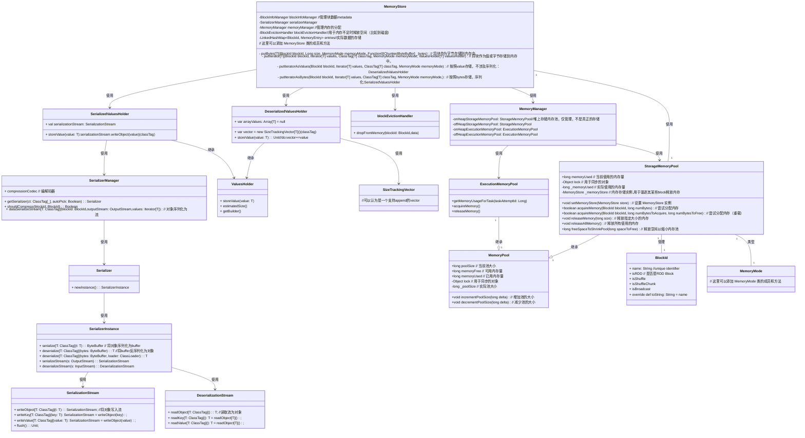
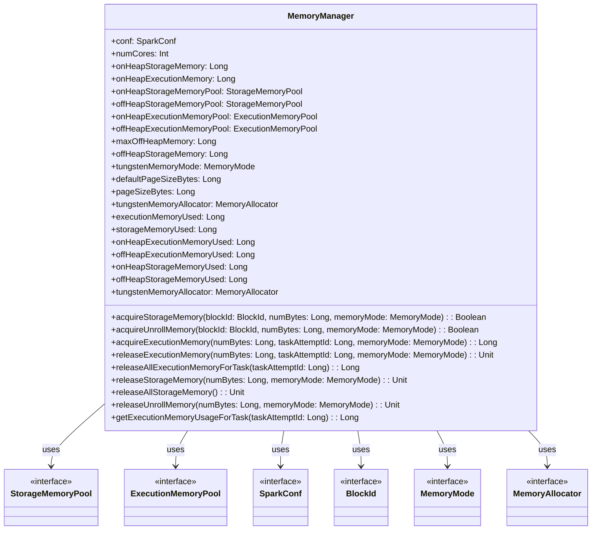

# MemoryStore

`MemoryStore` 类是 Spark 内存存储的一部分，用于在内存中存储块。这些块可以是反序列化的 Java 对象数组或序列化的 ByteBuffer。

## 类图

以下是 `MemoryStore`以及依赖类的类图和每个成员的注释：



## BlockId

BlockId类用于**标识**不同类型的数据块。在Spark中，数据块是数据的基本单位，数据块的标识对分布式数据处理非常重要。
`BlockId`是一个抽象类，所有数据块标识类都继承自这个类以下是几种具体的`BlockId`实现类：

### `RDDBlockId`

```scala
@DeveloperApi
case class RDDBlockId(rddId: Int, splitIndex: Int) extends BlockId {
  override def name: String = "rdd_" + rddId + "_" + splitIndex
}
```

用于标识RDD数据块，包含RDD ID和分片索引。

### `ShuffleBlockId`

```scala
@DeveloperApi
case class ShuffleBlockId(shuffleId: Int, mapId: Long, reduceId: Int) extends BlockId {
  override def name: String = "shuffle_" + shuffleId + "_" + mapId + "_" + reduceId
}
```

用于标识Shuffle数据块，包含Shuffle ID、map任务ID和reduce任务ID。

## SerializerManager

SerializerManager 类是 Spark 框架中的一个组件，它负责配置各种 Spark 组件的序列化、压缩和加密。这个类能够自动选择适合的 Serializer 用于 shuffle 操作。

### SerializerManager的成员和构造方法

```scala
private[spark] class SerializerManager(
    defaultSerializer: Serializer,
    conf: SparkConf,
    encryptionKey: Option[Array[Byte]]) {
```

- `defaultSerializer`: 默认的序列化器。
- `conf`: Spark 配置对象。
- `encryptionKey`: 可选的加密密钥。

### 配置相关变量

```scala
private[this] val compressBroadcast = conf.get(config.BROADCAST_COMPRESS)
private[this] val compressShuffle = conf.get(config.SHUFFLE_COMPRESS)
private[this] val compressRdds = conf.get(config.RDD_COMPRESS)
private[this] val compressShuffleSpill = conf.get(config.SHUFFLE_SPILL_COMPRESS)

private lazy val compressionCodec: CompressionCodec = CompressionCodec.createCodec(conf)
```

- 这些变量是从配置中读取的，决定了是否对广播变量、shuffle 输出、RDD 分区和 shuffle 暂存数据进行压缩。
- `compressionCodec` 是用于压缩的编解码器，它是一个懒加载变量，只有在第一次使用时才会初始化。

### 方法

#### 获取序列化器

```scala
def getSerializer(ct: ClassTag[_], autoPick: Boolean): Serializer = {
  if (autoPick && canUseKryo(ct)) {
    kryoSerializer
  } else {
    defaultSerializer
  }
}

def getSerializer(keyClassTag: ClassTag[_], valueClassTag: ClassTag[_]): Serializer = {
  if (canUseKryo(keyClassTag) && canUseKryo(valueClassTag)) {
    kryoSerializer
  } else {
    defaultSerializer
  }
}
```

- `getSerializer(ct: ClassTag[_], autoPick: Boolean)`: 根据类标签和是否自动选择来获取合适的序列化器。
- `getSerializer(keyClassTag: ClassTag[_], valueClassTag: ClassTag[_])`: 为键值对 RDD 选择最好的序列化器。

#### 是否需要压缩

```scala
private def shouldCompress(blockId: BlockId): Boolean = {
  blockId match {
    case _: ShuffleBlockId => compressShuffle
    case _: ShuffleBlockChunkId => compressShuffle
    case _: BroadcastBlockId => compressBroadcast
    case _: RDDBlockId => compressRdds
    case _: TempLocalBlockId => compressShuffleSpill
    case _: TempShuffleBlockId => compressShuffle
    case _: ShuffleBlockBatchId => compressShuffle
    case _ => false
  }
}
```

- 根据 `BlockId` 的类型，决定是否需要压缩。

#### 包装输入/输出流

```scala
def wrapForCompression(blockId: BlockId, s: OutputStream): OutputStream = {
  if (shouldCompress(blockId)) compressionCodec.compressedOutputStream(s) else s
}

def wrapForCompression(blockId: BlockId, s: InputStream): InputStream = {
  if (shouldCompress(blockId)) compressionCodec.compressedInputStream(s) else s
}
def wrapStream(blockId: BlockId, s: InputStream): InputStream = {
  wrapForCompression(blockId, wrapForEncryption(s))
}

def wrapStream(blockId: BlockId, s: OutputStream): OutputStream = {
  wrapForCompression(blockId, wrapForEncryption(s))
}

```

- 这些方法用于包装输入和输出流，以便添加加密和压缩功能。

#### 序列化和反序列化

```scala
def dataSerializeStream[T: ClassTag](
    blockId: BlockId,
    outputStream: OutputStream,
    values: Iterator[T]): Unit = {
  val byteStream = new BufferedOutputStream(outputStream)
  val autoPick = !blockId.isInstanceOf[StreamBlockId]
  val ser = getSerializer(implicitly[ClassTag[T]], autoPick).newInstance()
  ser.serializeStream(wrapForCompression(blockId, byteStream)).writeAll(values).close()
}

def dataSerialize[T: ClassTag](
    blockId: BlockId,
    values: Iterator[T]): ChunkedByteBuffer = {
  dataSerializeWithExplicitClassTag(blockId, values, implicitly[ClassTag[T]])
}

def dataSerializeWithExplicitClassTag(
    blockId: BlockId,
    values: Iterator[_],
    classTag: ClassTag[_]): ChunkedByteBuffer = {
  val bbos = new ChunkedByteBufferOutputStream(1024 * 1024 * 4, ByteBuffer.allocate)
  val byteStream = new BufferedOutputStream(bbos)
  val autoPick = !blockId.isInstanceOf[StreamBlockId]
  val ser = getSerializer(classTag, autoPick).newInstance()
  ser.serializeStream(wrapForCompression(blockId, byteStream)).writeAll(values).close()
  bbos.toChunkedByteBuffer
}

def dataDeserializeStream[T](
    blockId: BlockId,
    inputStream: InputStream)
    (classTag: ClassTag[T]): Iterator[T] = {
  val stream = new BufferedInputStream(inputStream)
  val autoPick = !blockId.isInstanceOf[StreamBlockId]
  getSerializer(classTag, autoPick)
    .newInstance()
    .deserializeStream(wrapForCompression(blockId, stream))
    .asIterator.asInstanceOf[Iterator[T]]
}
```

- `dataSerializeStream` 和 `dataSerialize` 用于将数据序列化到流或 `ChunkedByteBuffer` 中。
- `dataDeserializeStream` 用于从输入流中反序列化数据。

## SerializedValuesHolder

SerializedValuesHolder是用于存储序列化值的持有者类。该类封装了序列化值的存储和管理逻辑，主要用于 Spark 的存储模块

```scala
class SerializedValuesHolder[T](
    blockId: BlockId,
    chunkSize: Int,
    classTag: ClassTag[T],
    memoryMode: MemoryMode,
    serializerManager: SerializerManager) extends ValuesHolder[T] {
```

SerializedValuesHolder存储对象时，调用`storeValue(value: T)`,将对象写入`serializationStream`,最后在unroll结束后调用getBuilder()关闭流，将流转为buffer。

```scala
val serializationStream: SerializationStream = {
  val autoPick = !blockId.isInstanceOf[StreamBlockId]
  val ser = serializerManager.getSerializer(classTag, autoPick).newInstance()
  ser.serializeStream(serializerManager.wrapForCompression(blockId, redirectableStream))
}
override def storeValue(value: T): Unit = {
  serializationStream.writeObject(value)(classTag)
}
override def getBuilder(): MemoryEntryBuilder[T] = new MemoryEntryBuilder[T] {
   // We successfully unrolled the entirety of this block
   serializationStream.close()

   override def preciseSize: Long = bbos.size

   override def build(): MemoryEntry[T] =
   SerializedMemoryEntry[T](bbos.toChunkedByteBuffer, memoryMode, classTag)
}
```

### SerializerManager 总结

`SerializerManager` 类提供了对序列化、压缩和加密的全面管理。通过配置和上下文自动选择合适的序列化器，并通过包装输入输出流实现对数据的压缩和加密。这样设计的目的在于提高 Spark 处理数据的灵活性和安全性。

## MemoryManager

`MemoryManager` 类是 Spark 内存管理的抽象基类，负责在执行内存和存储内存之间分配和管理内存。它使用 `StorageMemoryPool` 和 `ExecutionMemoryPool` 来管理不同类型的内存池，并根据配置来处理堆内存和非堆内存的使用。

### `Mermaid` 图表

以下是 `MemoryManager` 类的 `Mermaid` 图表，展示了主要字段和方法的关系及其注释。



### 注释说明

- **字段**
  - `onHeapStorageMemoryPool` 和 `offHeapStorageMemoryPool` 负责管理存储内存的堆和非堆内存。
  - `onHeapExecutionMemoryPool` 和 `offHeapExecutionMemoryPool` 负责管理执行内存的堆和非堆内存。
  - `maxOffHeapMemory` 和 `offHeapStorageMemory` 用于配置和管理非堆内存的使用。
  - `tungstenMemoryMode` 决定了内存是使用堆内存还是非堆内存。
  - `defaultPageSizeBytes` 和 `pageSizeBytes` 确定页面的默认大小。

- **方法**
  - `acquireStorageMemory` 和 `acquireUnrollMemory` 用于请求存储和解压内存。
  - `acquireExecutionMemory` 用于请求执行内存。
  - `releaseExecutionMemory` 和 `releaseStorageMemory` 用于释放内存。
  - `executionMemoryUsed` 和 `storageMemoryUsed` 提供当前使用的内存量。

### 主要字段和方法

1. **字段**

   - `onHeapStorageMemoryPool` 和 `offHeapStorageMemoryPool`
     - `StorageMemoryPool` 的实例，用于管理堆内存和非堆内存中的存储内存。

   - `onHeapExecutionMemoryPool` 和 `offHeapExecutionMemoryPool`
     - `ExecutionMemoryPool` 的实例，用于管理堆内存和非堆内存中的执行内存。

   - `maxOffHeapMemory`
     - 最大的非堆内存大小。

   - `offHeapStorageMemory`
     - 分配给存储的非堆内存大小。

   - `tungstenMemoryMode`
     - 指示 Tungsten 内存分配是使用堆内存还是非堆内存。

   - `defaultPageSizeBytes`
     - 默认的页面大小。

   - `pageSizeBytes`
     - 配置的页面大小。

   - `tungstenMemoryAllocator`
     - 用于 Tungsten 内存的分配器。

2. **方法**

   - `acquireStorageMemory`
     - 请求存储内存，必要时会回收已有内存。

   - `acquireUnrollMemory`
     - 请求解压内存，允许子类区分存储内存和解压内存的行为。

   - `acquireExecutionMemory`
     - 请求执行内存，用于当前任务。

   - `releaseExecutionMemory`
     - 释放执行内存。

   - `releaseAllExecutionMemoryForTask`
     - 释放所有执行内存。

   - `releaseStorageMemory`
     - 释放存储内存。

   - `releaseAllStorageMemory`
     - 释放所有存储内存。

   - `releaseUnrollMemory`
     - 释放解压内存。

   - `executionMemoryUsed` 和 `storageMemoryUsed`
     - 获取当前使用的执行内存和存储内存。

   - `getExecutionMemoryUsageForTask`
     - 获取给定任务的执行内存使用情况。

   - `tungstenMemoryAllocator`
     - 根据内存模式选择合适的内存分配器。

在 `MemoryManager` 类中，各内存池的大小确定过程如下：

### 内存池大小的确定

1. **堆内存池（On-Heap Memory Pools）**

   - `onHeapStorageMemoryPool`
     - **大小确定**: `onHeapStorageMemory`。
     - **说明**: 在构造函数中，`onHeapStorageMemoryPool` 的大小由 `onHeapStorageMemory` 确定。`onHeapStorageMemory` 是通过配置文件（`SparkConf`）中指定的配置项来确定的，例如 `spark.memory.storageFraction`，它决定了堆内存中分配给存储的比例。

   - `onHeapExecutionMemoryPool`
     - **大小确定**: `onHeapExecutionMemory`。
     - **说明**: `onHeapExecutionMemoryPool` 的大小由 `onHeapExecutionMemory` 确定。`onHeapExecutionMemory` 是通过配置文件（`SparkConf`）中的配置项 `spark.memory.fraction` 来决定的，这个配置项定义了总堆内存中分配给执行内存的比例。

2. **非堆内存池（Off-Heap Memory Pools）**

   - `offHeapStorageMemoryPool`
     - **大小确定**: `offHeapStorageMemory`。
     - **说明**: 在构造函数中，`offHeapStorageMemoryPool` 的大小由 `offHeapStorageMemory` 确定。`offHeapStorageMemory` 是通过配置项 `spark.memory.offHeap.size` 和 `spark.memory.storageFraction` 计算得出的。具体来说，`offHeapStorageMemory` 是从 `maxOffHeapMemory` 中按照 `spark.memory.storageFraction` 配置项计算出来的。这个值决定了非堆内存中用于存储的内存量。

   - `offHeapExecutionMemoryPool`
     - **大小确定**: `maxOffHeapMemory - offHeapStorageMemory`。
     - **说明**: `offHeapExecutionMemoryPool` 的大小是剩余的非堆内存量，即 `maxOffHeapMemory` 减去 `offHeapStorageMemory`。这个值决定了非堆内存中用于执行的内存量。

### 计算过程

1. **堆内存池的大小计算**
   - `onHeapStorageMemory` 和 `onHeapExecutionMemory` 分别由 `spark.memory.storageFraction` 和 `spark.memory.fraction` 配置项来确定。这两个值是对堆内存进行分配时的依据。

2. **非堆内存池的大小计算**
   - `maxOffHeapMemory` 由 `spark.memory.offHeap.size` 配置项确定，表示总的非堆内存大小。
   - `offHeapStorageMemory` 是从 `maxOffHeapMemory` 中分配给存储的内存，计算公式为 `maxOffHeapMemory * spark.memory.storageFraction`。
   - `offHeapExecutionMemory` 是非堆内存中剩余的部分，即 `maxOffHeapMemory - offHeapStorageMemory`。

### 示例

假设有如下配置：

- `spark.memory.storageFraction = 0.5`
- `spark.memory.fraction = 0.6`
- `spark.memory.offHeap.size = 2GB` (即 2 *1024* 1024 * 1024 字节)

那么计算结果如下：

- **堆内存**: 假设堆内存总量为 4GB (即 4 *1024* 1024 * 1024 字节)
  - `onHeapStorageMemory = 0.5 * 4GB = 2GB`
  - `onHeapExecutionMemory = 0.6 * 4GB - onHeapStorageMemory = 2.4GB - 2GB = 0.4GB`

- **非堆内存**:
  - `offHeapStorageMemory = 2GB * 0.5 = 1GB`
  - `offHeapExecutionMemory = 2GB - 1GB = 1GB`

这些计算确保了 Spark 可以根据配置和实际内存资源进行适当的内存分配和管理。

## MemoryStore 源码分析

### 类定义和构造函数

```scala
private[spark] class MemoryStore(
    conf: SparkConf,
    blockInfoManager: BlockInfoManager,
    serializerManager: SerializerManager,
    memoryManager: MemoryManager,
    blockEvictionHandler: BlockEvictionHandler)
  extends Logging {
```

- `MemoryStore` 是一个私有类，扩展了 `Logging`，允许记录日志。
- 它依赖于 `SparkConf`、`BlockInfoManager`、`SerializerManager`、`MemoryManager` 和 `BlockEvictionHandler` 作为构造函数参数。

### 成员变量

```scala
private val entries = new LinkedHashMap[BlockId, MemoryEntry[_]](32, 0.75f, true)
private val onHeapUnrollMemoryMap = mutable.HashMap[Long, Long]()
private val offHeapUnrollMemoryMap = mutable.HashMap[Long, Long]()
private val unrollMemoryThreshold: Long = conf.get(STORAGE_UNROLL_MEMORY_THRESHOLD)
```

- `entries`: 用于存储块的 LinkedHashMap，允许按照最近最少使用 (LRU) 的顺序进行迭代。
- `onHeapUnrollMemoryMap` 和 `offHeapUnrollMemoryMap`: 记录每个任务尝试展开块时所用的堆内和堆外内存。
- `unrollMemoryThreshold`: 在展开任何块之前请求的初始内存量。

### 内存管理

```scala
private def maxMemory: Long = {
    memoryManager.maxOnHeapStorageMemory + memoryManager.maxOffHeapStorageMemory
}

private def memoryUsed: Long = memoryManager.storageMemoryUsed

private def blocksMemoryUsed: Long = memoryManager.synchronized {
    memoryUsed - currentUnrollMemory
}
```

- `maxMemory`: 返回可用于存储的最大内存量。
- `memoryUsed`: 返回当前使用的存储内存总量。
- `blocksMemoryUsed`: 返回用于缓存块的内存量，不包括展开内存。

### 放置和获取块的方法

#### `putBytes` 方法

```scala
def putBytes[T: ClassTag](
    blockId: BlockId,
    size: Long,
    memoryMode: MemoryMode,
    _bytes: () => ChunkedByteBuffer): Boolean = {
    require(!contains(blockId), s"Block $blockId is already present in the MemoryStore")
    if (memoryManager.acquireStorageMemory(blockId, size, memoryMode)) {
        val bytes = _bytes()
        assert(bytes.size == size)
        val entry = new SerializedMemoryEntry[T](bytes, memoryMode, implicitly[ClassTag[T]])
        entries.synchronized {
            entries.put(blockId, entry)
        }
        logInfo(s"Block $blockId stored as bytes in memory (estimated size $size, free ${maxMemory - blocksMemoryUsed})")
        true
    } else {
        false
    }
}
```

- `putBytes` 方法用于将块作为字节存储到内存中。
- 首先检查块是否已经存在，然后尝试获取存储该块所需的内存。
- 如果成功，则将块存储到 `entries` 中并记录日志。

#### `putIterator` 方法

```scala
private def putIterator[T](
    blockId: BlockId,
    values: Iterator[T],
    classTag: ClassTag[T],
    memoryMode: MemoryMode,
    valuesHolder: ValuesHolder[T]): Either[Long, Long] = {
    // 方法实现
}
```

- `putIterator` 方法尝试将给定的块作为值或字节存储到内存中。
- 它逐渐展开迭代器，同时定期检查是否有足够的内存，以避免 OOM 异常。
- 如果成功展开并存储块，则返回存储的数据大小；否则，返回用于展开块的内存量。

#### `getBytes` 和 `getValues` 方法

```scala
def getBytes(blockId: BlockId): Option[ChunkedByteBuffer] = {
    val entry = entries.synchronized { entries.get(blockId) }
    entry match {
        case null => None
        case _: DeserializedMemoryEntry[_] =>
            throw SparkException.internalError("should only call getBytes on serialized blocks")
        case SerializedMemoryEntry(bytes, _, _) => Some(bytes)
    }
}

def getValues(blockId: BlockId): Option[Iterator[_]] = {
    val entry = entries.synchronized { entries.get(blockId) }
    entry match {
        case null => None
        case e: SerializedMemoryEntry[_] =>
            throw SparkException.internalError("should only call getValues on deserialized blocks")
        case DeserializedMemoryEntry(values, _, _, _) =>
            Some(values.iterator)
    }
}
```

- `getBytes` 方法用于获取块的字节表示。
- `getValues` 方法用于获取块的值表示。

### 内存清理和块移除

#### `remove` 方法

```scala
def remove(blockId: BlockId): Boolean = memoryManager.synchronized {
    val entry = entries.synchronized {
        entries.remove(blockId)
    }
    if (entry != null) {
        freeMemoryEntry(entry)
        memoryManager.releaseStorageMemory(entry.size, entry.memoryMode)
        true
    } else {
        false
    }
}
```

- `remove` 方法用于移除指定的块。
- 它首先从 `entries` 中移除块，然后释放相应的内存。

#### `clear` 方法

```scala
def clear(): Unit = memoryManager.synchronized {
    entries.synchronized {
        entries.values.asScala.foreach(freeMemoryEntry)
        entries.clear()
    }
    onHeapUnrollMemoryMap.clear()
    offHeapUnrollMemoryMap.clear()
    memoryManager.releaseAllStorageMemory()
    logInfo("MemoryStore cleared")
}
```

- `clear` 方法用于清空 `MemoryStore` 中的所有块并释放所有内存。

### 解卷操作(unroll)

!!! tip 迭代器
      **迭代器**（Iterator）是一种设计模式，它提供一种方式来访问一个集合对象中的各个元素，而无需暴露该对象的内部表示。迭代器通常用于遍历列表、集合等数据结构。
      
      在 Scala 中，`Iterator` 是一个标准的接口，它允许顺序访问集合中的元素，而不需要提前知道集合的大小。

      ```scala
      val numbers = List(1, 2, 3, 4, 5)
      val iterator = numbers.iterator

      while (iterator.hasNext) {
         println(iterator.next())
      }
      ```
      在这个例子中，`iterator` 是一个用于遍历 `numbers` 列表的迭代器。

#### 临时展开内存

**临时展开内存**（Unroll Memory）是在计算过程中临时分配的内存，用于存储中间结果。在 Spark 中，临时展开内存用于在将数据块放入内存存储之前展开迭代器的数据。

临时展开内存的使用示例如下：

#### 迭代器示例

假设我们有一个需要存储到内存中的迭代器，我们需要逐步展开这个迭代器，并在展开过程中确保有足够的内存来存储中间结果。这个过程使用临时展开内存来避免一次性分配过多内存导致 OOM（内存不足）异常。

```scala
import scala.reflect.ClassTag
import org.apache.spark.storage.{BlockId, MemoryMode}
import org.apache.spark.memory.{MemoryManager, TaskMemoryManager}
import org.apache.spark.internal.Logging

class MemoryStore extends Logging {
// 假设一个简单的内存管理器
val memoryManager = new MemoryManager(null, null, 0.6, 0.4, 1)

def putIterator[T: ClassTag](
   blockId: BlockId,
   values: Iterator[T],
   memoryMode: MemoryMode): Either[Long, Long] = {

   var elementsUnrolled = 0
   var keepUnrolling = true
   var unrollMemoryUsed = 0L
   val initialMemoryThreshold = 1024L
   var memoryThreshold = initialMemoryThreshold

   keepUnrolling = memoryManager.acquireUnrollMemory(blockId, initialMemoryThreshold, memoryMode)

   if (!keepUnrolling) {
      logWarning(s"Failed to reserve initial memory threshold of $initialMemoryThreshold bytes.")
   } else {
      unrollMemoryUsed += initialMemoryThreshold
   }

   while (values.hasNext && keepUnrolling) {
      val value = values.next()
      elementsUnrolled += 1
      // 估算当前存储的大小
      val currentSize = elementsUnrolled * 8L // 假设每个元素占用 8 字节
      if (currentSize >= memoryThreshold) {
      val amountToRequest = currentSize * 2 - memoryThreshold
      keepUnrolling = memoryManager.acquireUnrollMemory(blockId, amountToRequest, memoryMode)
      if (keepUnrolling) {
         unrollMemoryUsed += amountToRequest
      }
      memoryThreshold += amountToRequest
      }
   }

   if (keepUnrolling) {
      Right(unrollMemoryUsed)
   } else {
      Left(unrollMemoryUsed)
   }
}
}

// 示例使用
object MemoryStoreExample extends App {
val memoryStore = new MemoryStore
val blockId = new BlockId {
   override def name: String = "exampleBlock"
}
val values = Iterator(1, 2, 3, 4, 5)

val result = memoryStore.putIterator(blockId, values, MemoryMode.ON_HEAP)
result match {
   case Right(size) => println(s"Block stored successfully with size $size bytes.")
   case Left(memoryUsed) => println(s"Failed to store block. Unrolled memory used: $memoryUsed bytes.")
}
}
```

在这个示例中，`putIterator` 方法逐步展开 `values` 迭代器，并定期检查是否需要请求更多内存。`MemoryManager` 用于管理临时展开内存的分配和释放。

### 其他方法

- `evictBlocksToFreeSpace`: 尝试逐出块以腾出指定空间用于存储新块。
- `reserveUnrollMemoryForThisTask`: 为当前任务保留展开内存。

这些方法共同工作，确保内存块的存储和管理能够高效且安全地进行。通过对内存块的操作进行同步控制，可以避免并发问题，并确保内存的高效利用。

`MemoryStore` 类用于在内存中管理和存储数据块。它有多种内存管理策略，包括处理数据块的序列化和反序列化。以下是该类主要功能和方法的简要说明：

1. **成员变量和构造函数**：
   - `entries`: 使用 `LinkedHashMap` 存储所有块的信息。
   - `onHeapUnrollMemoryMap` 和 `offHeapUnrollMemoryMap`: 分别用于记录堆内存和堆外内存中用于解卷的内存量。
   - `unrollMemoryThreshold`: 解卷块之前请求的初始内存量。

2. **主要方法**：
   - `putBytes`: 尝试将一个字节数组放入内存。如果内存足够，就将块存储为字节；否则返回 `false`。
   - `putIterator`: 尝试将一个迭代器中的数据放入内存。这是一个逐步解卷的过程，以避免内存溢出。
   - `putIteratorAsValues` 和 `putIteratorAsBytes`: 分别将数据块以值或字节形式存储到内存中。
   - `getBytes` 和 `getValues`: 根据块 ID 获取存储的字节或值。
   - `remove`: 移除指定块的内存条目，并释放相关内存。
   - `clear`: 清除所有块，释放所有内存。
   - `evictBlocksToFreeSpace`: 尝试通过逐出其他块来释放指定空间。

3. **内存管理**：
   - `reserveUnrollMemoryForThisTask` 和 `releaseUnrollMemoryForThisTask`: 分别用于请求和释放用于解卷的内存。
   - `currentUnrollMemory` 和 `currentUnrollMemoryForThisTask`: 获取当前内存使用情况。

4. **日志记录**：
   - 类中大量使用日志记录（`logInfo`, `logWarning` 等）来跟踪内存使用情况和操作结果。

### 代码中的一些关键点

- **线程安全**：在处理内存和块操作时，使用 `synchronized` 确保线程安全。
- **内存策略**：支持堆内存和堆外内存两种存储模式，并且根据内存情况动态调整内存使用策略。
- **解卷策略**：为了防止 OOM 异常，`putIterator` 方法会逐步解卷数据，同时动态请求内存。
