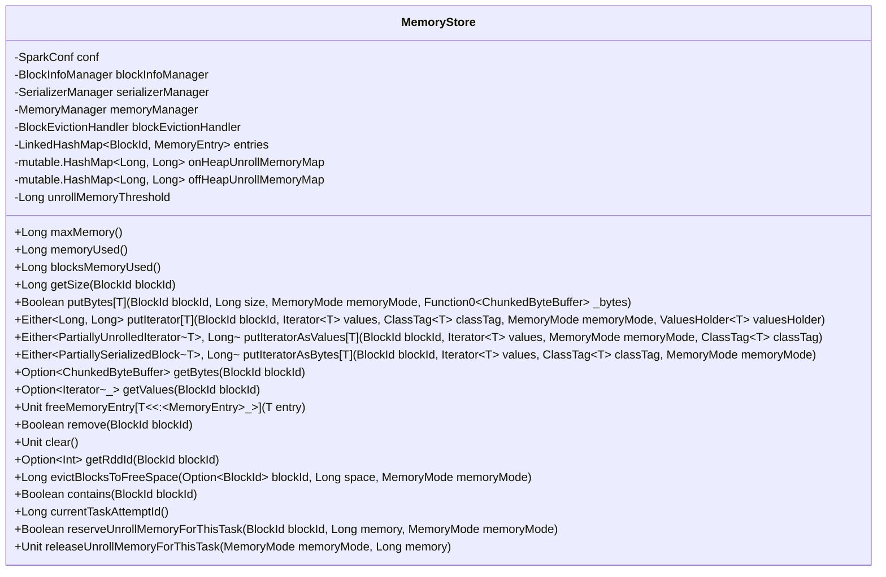

# MemoryStore

`MemoryStore` 类是 Spark 内存存储的一部分，用于在内存中存储块。这些块可以是反序列化的 Java 对象数组或序列化的 ByteBuffer。以下是代码的主要部分和功能的详细解释：

## 类图

以下是 `MemoryStore` 类的 Mermaid 图和每个成员的注释：



### 类和成员注释

1. **MemoryStore**
   - **conf**: `SparkConf` 对象，用于存储 Spark 配置。
   - **blockInfoManager**: `BlockInfoManager` 对象，用于管理块的信息。
   - **serializerManager**: `SerializerManager` 对象，用于管理序列化和反序列化。
   - **memoryManager**: `MemoryManager` 对象，用于管理内存分配。
   - **blockEvictionHandler**: `BlockEvictionHandler` 对象，用于处理块的驱逐。
   - **entries**: `LinkedHashMap[BlockId, MemoryEntry[_]]`，存储内存中的块条目。
   - **onHeapUnrollMemoryMap**: `mutable.HashMap[Long, Long]`，存储展开块时使用的堆内存。
   - **offHeapUnrollMemoryMap**: `mutable.HashMap[Long, Long]`，存储展开块时使用的堆外内存。
   - **unrollMemoryThreshold**: `Long`，在展开任何块之前请求的初始内存。
   - **maxMemory()**: 返回总的存储内存（字节）。
   - **memoryUsed()**: 返回使用的总存储内存（字节）。
   - **blocksMemoryUsed()**: 返回用于缓存块的存储内存（不包括展开内存）。
   - **getSize(BlockId blockId)**: 获取指定块的大小。
   - **putBytes[T](BlockId blockId, Long size, MemoryMode memoryMode, Function0[ChunkedByteBuffer] _bytes)**: 将块作为字节存储到内存中。
   - **putIterator[T](BlockId blockId, Iterator[T] values, ClassTag[T] classTag, MemoryMode memoryMode, ValuesHolder[T] valuesHolder)**: 将块作为值或字节存储到内存中。
   - **putIteratorAsValues[T](BlockId blockId, Iterator[T] values, MemoryMode memoryMode, ClassTag[T] classTag)**: 将块作为值存储到内存中。
   - **putIteratorAsBytes[T](BlockId blockId, Iterator[T] values, ClassTag[T] classTag, MemoryMode memoryMode)**: 将块作为字节存储到内存中。
   - **getBytes(BlockId blockId)**: 获取块的字节内容。
   - **getValues(BlockId blockId)**: 获取块的值内容。
   - **freeMemoryEntry[T <: MemoryEntry[_]](T entry)**: 释放指定的内存条目。
   - **remove(BlockId blockId)**: 从内存中移除指定的块。
   - **clear()**: 清除内存存储。
   - **getRddId(BlockId blockId)**: 返回给定块 ID 所属的 RDD ID。
   - **evictBlocksToFreeSpace(Option[BlockId] blockId, Long space, MemoryMode memoryMode)**: 尝试驱逐块以释放指定的空间。
   - **contains(BlockId blockId)**: 检查内存中是否包含指定的块。
   - **currentTaskAttemptId()**: 返回当前任务尝试的 ID。
   - **reserveUnrollMemoryForThisTask(BlockId blockId, Long memory, MemoryMode memoryMode)**: 为任务展开块保留内存。
   - **releaseUnrollMemoryForThisTask(MemoryMode memoryMode, Long memory)**: 释放任务展开块保留的内存。

以上 Mermaid 图展示了 `MemoryStore` 类的结构及其主要成员，并为每个成员添加了注释，以帮助理解其作用和功能。

## 源码分析

### 类定义和构造函数

```scala
private[spark] class MemoryStore(
    conf: SparkConf,
    blockInfoManager: BlockInfoManager,
    serializerManager: SerializerManager,
    memoryManager: MemoryManager,
    blockEvictionHandler: BlockEvictionHandler)
  extends Logging {
```

- `MemoryStore` 是一个私有类，扩展了 `Logging`，允许记录日志。
- 它依赖于 `SparkConf`、`BlockInfoManager`、`SerializerManager`、`MemoryManager` 和 `BlockEvictionHandler` 作为构造函数参数。

### 成员变量

```scala
private val entries = new LinkedHashMap[BlockId, MemoryEntry[_]](32, 0.75f, true)
private val onHeapUnrollMemoryMap = mutable.HashMap[Long, Long]()
private val offHeapUnrollMemoryMap = mutable.HashMap[Long, Long]()
private val unrollMemoryThreshold: Long = conf.get(STORAGE_UNROLL_MEMORY_THRESHOLD)
```

- `entries`: 用于存储块的 LinkedHashMap，允许按照最近最少使用 (LRU) 的顺序进行迭代。
- `onHeapUnrollMemoryMap` 和 `offHeapUnrollMemoryMap`: 记录每个任务尝试展开块时所用的堆内和堆外内存。
- `unrollMemoryThreshold`: 在展开任何块之前请求的初始内存量。

### 内存管理

```scala
private def maxMemory: Long = {
    memoryManager.maxOnHeapStorageMemory + memoryManager.maxOffHeapStorageMemory
}

private def memoryUsed: Long = memoryManager.storageMemoryUsed

private def blocksMemoryUsed: Long = memoryManager.synchronized {
    memoryUsed - currentUnrollMemory
}
```

- `maxMemory`: 返回可用于存储的最大内存量。
- `memoryUsed`: 返回当前使用的存储内存总量。
- `blocksMemoryUsed`: 返回用于缓存块的内存量，不包括展开内存。

### 放置和获取块的方法

#### `putBytes` 方法

```scala
def putBytes[T: ClassTag](
    blockId: BlockId,
    size: Long,
    memoryMode: MemoryMode,
    _bytes: () => ChunkedByteBuffer): Boolean = {
    require(!contains(blockId), s"Block $blockId is already present in the MemoryStore")
    if (memoryManager.acquireStorageMemory(blockId, size, memoryMode)) {
        val bytes = _bytes()
        assert(bytes.size == size)
        val entry = new SerializedMemoryEntry[T](bytes, memoryMode, implicitly[ClassTag[T]])
        entries.synchronized {
            entries.put(blockId, entry)
        }
        logInfo(s"Block $blockId stored as bytes in memory (estimated size $size, free ${maxMemory - blocksMemoryUsed})")
        true
    } else {
        false
    }
}
```

- `putBytes` 方法用于将块作为字节存储到内存中。
- 首先检查块是否已经存在，然后尝试获取存储该块所需的内存。
- 如果成功，则将块存储到 `entries` 中并记录日志。

#### `putIterator` 方法

```scala
private def putIterator[T](
    blockId: BlockId,
    values: Iterator[T],
    classTag: ClassTag[T],
    memoryMode: MemoryMode,
    valuesHolder: ValuesHolder[T]): Either[Long, Long] = {
    // 方法实现
}
```

- `putIterator` 方法尝试将给定的块作为值或字节存储到内存中。
- 它逐渐展开迭代器，同时定期检查是否有足够的内存，以避免 OOM 异常。
- 如果成功展开并存储块，则返回存储的数据大小；否则，返回用于展开块的内存量。

#### `getBytes` 和 `getValues` 方法

```scala
def getBytes(blockId: BlockId): Option[ChunkedByteBuffer] = {
    val entry = entries.synchronized { entries.get(blockId) }
    entry match {
        case null => None
        case _: DeserializedMemoryEntry[_] =>
            throw SparkException.internalError("should only call getBytes on serialized blocks")
        case SerializedMemoryEntry(bytes, _, _) => Some(bytes)
    }
}

def getValues(blockId: BlockId): Option[Iterator[_]] = {
    val entry = entries.synchronized { entries.get(blockId) }
    entry match {
        case null => None
        case e: SerializedMemoryEntry[_] =>
            throw SparkException.internalError("should only call getValues on deserialized blocks")
        case DeserializedMemoryEntry(values, _, _, _) =>
            Some(values.iterator)
    }
}
```

- `getBytes` 方法用于获取块的字节表示。
- `getValues` 方法用于获取块的值表示。

### 内存清理和块移除

#### `remove` 方法

```scala
def remove(blockId: BlockId): Boolean = memoryManager.synchronized {
    val entry = entries.synchronized {
        entries.remove(blockId)
    }
    if (entry != null) {
        freeMemoryEntry(entry)
        memoryManager.releaseStorageMemory(entry.size, entry.memoryMode)
        true
    } else {
        false
    }
}
```

- `remove` 方法用于移除指定的块。
- 它首先从 `entries` 中移除块，然后释放相应的内存。

#### `clear` 方法

```scala
def clear(): Unit = memoryManager.synchronized {
    entries.synchronized {
        entries.values.asScala.foreach(freeMemoryEntry)
        entries.clear()
    }
    onHeapUnrollMemoryMap.clear()
    offHeapUnrollMemoryMap.clear()
    memoryManager.releaseAllStorageMemory()
    logInfo("MemoryStore cleared")
}
```

- `clear` 方法用于清空 `MemoryStore` 中的所有块并释放所有内存。

### 其他方法

- `evictBlocksToFreeSpace`: 尝试逐出块以腾出指定空间用于存储新块。
- `reserveUnrollMemoryForThisTask`: 为当前任务保留展开内存。

这些方法共同工作，确保内存块的存储和管理能够高效且安全地进行。通过对内存块的操作进行同步控制，可以避免并发问题，并确保内存的高效利用。

`MemoryStore` 类用于在内存中管理和存储数据块。它有多种内存管理策略，包括处理数据块的序列化和反序列化。以下是该类主要功能和方法的简要说明：

1. **成员变量和构造函数**：
   - `entries`: 使用 `LinkedHashMap` 存储所有块的信息。
   - `onHeapUnrollMemoryMap` 和 `offHeapUnrollMemoryMap`: 分别用于记录堆内存和堆外内存中用于解卷的内存量。
   - `unrollMemoryThreshold`: 解卷块之前请求的初始内存量。

2. **主要方法**：
   - `putBytes`: 尝试将一个字节数组放入内存。如果内存足够，就将块存储为字节；否则返回 `false`。
   - `putIterator`: 尝试将一个迭代器中的数据放入内存。这是一个逐步解卷的过程，以避免内存溢出。
   - `putIteratorAsValues` 和 `putIteratorAsBytes`: 分别将数据块以值或字节形式存储到内存中。
   - `getBytes` 和 `getValues`: 根据块 ID 获取存储的字节或值。
   - `remove`: 移除指定块的内存条目，并释放相关内存。
   - `clear`: 清除所有块，释放所有内存。
   - `evictBlocksToFreeSpace`: 尝试通过逐出其他块来释放指定空间。

3. **内存管理**：
   - `reserveUnrollMemoryForThisTask` 和 `releaseUnrollMemoryForThisTask`: 分别用于请求和释放用于解卷的内存。
   - `currentUnrollMemory` 和 `currentUnrollMemoryForThisTask`: 获取当前内存使用情况。

4. **日志记录**：
   - 类中大量使用日志记录（`logInfo`, `logWarning` 等）来跟踪内存使用情况和操作结果。

## 代码中的一些关键点

- **线程安全**：在处理内存和块操作时，使用 `synchronized` 确保线程安全。
- **内存策略**：支持堆内存和堆外内存两种存储模式，并且根据内存情况动态调整内存使用策略。
- **解卷策略**：为了防止 OOM 异常，`putIterator` 方法会逐步解卷数据，同时动态请求内存。

!!! tip unrolling

      ### 迭代器
      **迭代器**（Iterator）是一种设计模式，它提供一种方式来访问一个集合对象中的各个元素，而无需暴露该对象的内部表示。迭代器通常用于遍历列表、集合等数据结构。

      在 Scala 中，`Iterator` 是一个标准的接口，它允许顺序访问集合中的元素，而不需要提前知道集合的大小。

      #### 示例
      ```scala
      val numbers = List(1, 2, 3, 4, 5)
      val iterator = numbers.iterator

      while (iterator.hasNext) {
      println(iterator.next())
      }
      ```
      在这个例子中，`iterator` 是一个用于遍历 `numbers` 列表的迭代器。

      ### 物化
      **物化**（Materialization）是指将数据从一种表示形式转换为另一种表示形式，通常是从延迟计算的表示形式转换为实际存储在内存或磁盘中的表示形式。在大数据处理系统中，物化常用于将惰性计算结果具体化，以便后续操作可以直接访问。

      #### 示例
      ```scala
      val rdd = sc.parallelize(Seq(1, 2, 3, 4, 5)) // 创建一个 RDD
      val filteredRDD = rdd.filter(_ % 2 == 0) // 延迟计算：过滤偶数

      val result = filteredRDD.collect() // 物化：将结果从 RDD 转换为数组
      println(result.mkString(", ")) // 输出：2, 4
      ```
      在这个例子中，`filteredRDD` 是一个延迟计算的 RDD，只有在调用 `collect` 方法时才会物化，将数据加载到内存中。

      ### 临时展开内存
      **临时展开内存**（Unroll Memory）是在计算过程中临时分配的内存，用于存储中间结果。在 Spark 中，临时展开内存用于在将数据块放入内存存储之前展开迭代器的数据。

      临时展开内存的使用示例如下：

      #### 示例
      假设我们有一个需要存储到内存中的迭代器，我们需要逐步展开这个迭代器，并在展开过程中确保有足够的内存来存储中间结果。这个过程使用临时展开内存来避免一次性分配过多内存导致 OOM（内存不足）异常。

      ```scala
      import scala.reflect.ClassTag
      import org.apache.spark.storage.{BlockId, MemoryMode}
      import org.apache.spark.memory.{MemoryManager, TaskMemoryManager}
      import org.apache.spark.internal.Logging

      class MemoryStore extends Logging {
      // 假设一个简单的内存管理器
      val memoryManager = new MemoryManager(null, null, 0.6, 0.4, 1)

      def putIterator[T: ClassTag](
         blockId: BlockId,
         values: Iterator[T],
         memoryMode: MemoryMode): Either[Long, Long] = {

         var elementsUnrolled = 0
         var keepUnrolling = true
         var unrollMemoryUsed = 0L
         val initialMemoryThreshold = 1024L
         var memoryThreshold = initialMemoryThreshold

         keepUnrolling = memoryManager.acquireUnrollMemory(blockId, initialMemoryThreshold, memoryMode)

         if (!keepUnrolling) {
            logWarning(s"Failed to reserve initial memory threshold of $initialMemoryThreshold bytes.")
         } else {
            unrollMemoryUsed += initialMemoryThreshold
         }

         while (values.hasNext && keepUnrolling) {
            val value = values.next()
            elementsUnrolled += 1
            // 估算当前存储的大小
            val currentSize = elementsUnrolled * 8L // 假设每个元素占用 8 字节
            if (currentSize >= memoryThreshold) {
            val amountToRequest = currentSize * 2 - memoryThreshold
            keepUnrolling = memoryManager.acquireUnrollMemory(blockId, amountToRequest, memoryMode)
            if (keepUnrolling) {
               unrollMemoryUsed += amountToRequest
            }
            memoryThreshold += amountToRequest
            }
         }

         if (keepUnrolling) {
            Right(unrollMemoryUsed)
         } else {
            Left(unrollMemoryUsed)
         }
      }
      }

      // 示例使用
      object MemoryStoreExample extends App {
      val memoryStore = new MemoryStore
      val blockId = new BlockId {
         override def name: String = "exampleBlock"
      }
      val values = Iterator(1, 2, 3, 4, 5)

      val result = memoryStore.putIterator(blockId, values, MemoryMode.ON_HEAP)
      result match {
         case Right(size) => println(s"Block stored successfully with size $size bytes.")
         case Left(memoryUsed) => println(s"Failed to store block. Unrolled memory used: $memoryUsed bytes.")
      }
      }
      ```

      在这个示例中，`putIterator` 方法逐步展开 `values` 迭代器，并定期检查是否需要请求更多内存。`MemoryManager` 用于管理临时展开内存的分配和释放。
