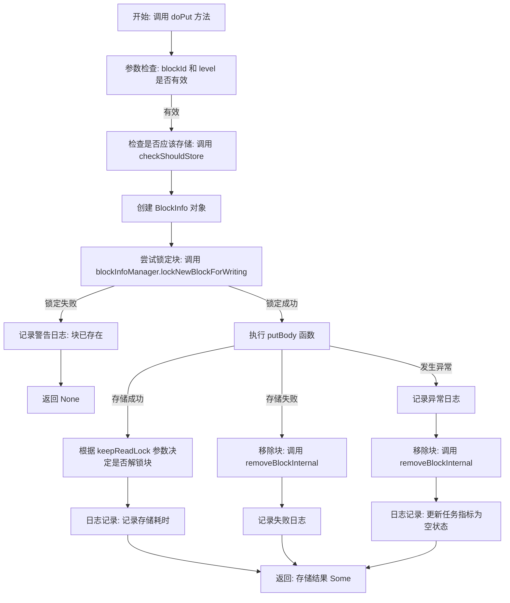

# doput

下面是用 Mermaid 生成的 `doPut` 方法的流程图代码：

```mermaid
flowchart TD
    A[开始: 调用 doPut 方法] --> B[参数检查: blockId 和 level 是否有效]
    B --> |有效| C[检查是否应该存储: 调用 checkShouldStore]
    C --> D[创建 BlockInfo 对象]
    D --> E[尝试锁定块: 调用 blockInfoManager.lockNewBlockForWriting]
    E --> |锁定成功| F[执行 putBody 函数]
    F --> |存储成功| G[根据 keepReadLock 参数决定是否解锁块]
    G --> H[日志记录: 记录存储耗时]
    H --> I[返回: 存储结果 None]
    F --> |存储失败| J[移除块: 调用 removeBlockInternal]
    J --> K[记录失败日志]
    K --> I[返回: 存储结果 Some]
    E --> |锁定失败| L[记录警告日志: 块已存在]
    L --> M[返回 None]

    F --> |发生异常| N[记录异常日志]
    N --> O[移除块: 调用 removeBlockInternal]
    O --> P[日志记录: 更新任务指标为空状态]
    P --> I
```

这个 Mermaid 图描述了 `doPut` 方法的主要流程，包括参数检查、块信息创建与锁定、存储逻辑执行、异常处理以及最终的返回结果。您可以将这段代码复制到支持 Mermaid 的 Markdown 编辑器或工具中，以生成对应的流程图。
