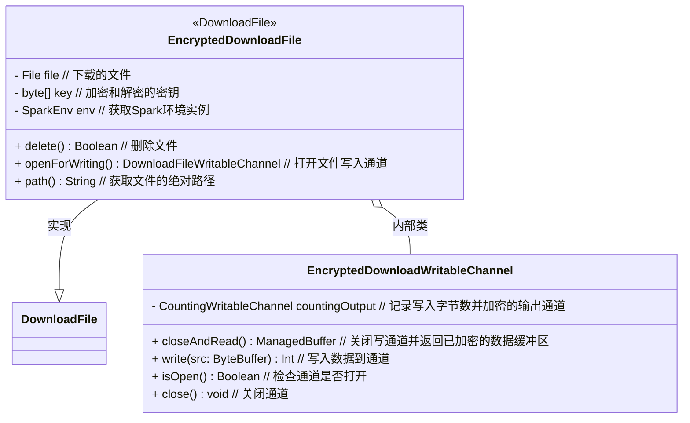
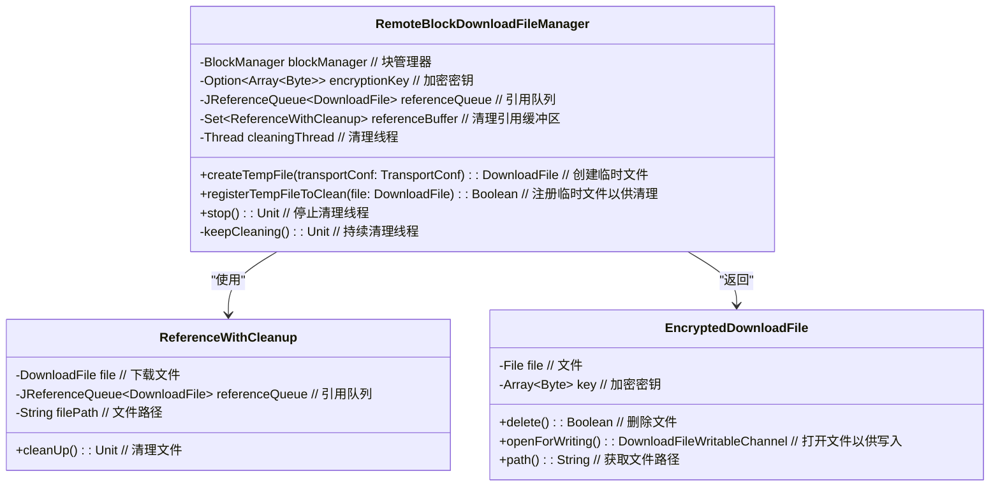

# outer

```mermaid
classDiagram
    %% 类说明
    class EncryptedDownloadFile {
        <<DownloadFile>> 
        - File file // 下载的文件
        - byte[] key // 加密和解密的密钥
        - SparkEnv env // 获取Spark环境实例

        + delete() Boolean // 删除文件
        + openForWriting() DownloadFileWritableChannel // 打开文件写入通道
        + path() String // 获取文件的绝对路径
    }

    class EncryptedDownloadWritableChannel {
        - CountingWritableChannel countingOutput // 记录写入字节数并加密的输出通道

        + closeAndRead() ManagedBuffer // 关闭写通道并返回已加密的数据缓冲区
        + write(src: ByteBuffer) Int // 写入数据到通道
        + isOpen() Boolean // 检查通道是否打开
        + close() void // 关闭通道
    }

    %% 关系
    EncryptedDownloadFile --|> DownloadFile : 实现
    EncryptedDownloadFile o-- EncryptedDownloadWritableChannel : 内部类
    
```

```mermaid
classDiagram
    class RemoteBlockDownloadFileManager {
        -BlockManager blockManager // 块管理器
        -Option~Array~Byte~~ encryptionKey // 加密密钥
        -JReferenceQueue~DownloadFile~ referenceQueue // 引用队列
        -Set~ReferenceWithCleanup~ referenceBuffer // 清理引用缓冲区
        -Thread cleaningThread // 清理线程
        +createTempFile(transportConf: TransportConf): DownloadFile // 创建临时文件
        +registerTempFileToClean(file: DownloadFile): Boolean // 注册临时文件以供清理
        +stop(): Unit // 停止清理线程
        -keepCleaning(): Unit // 持续清理线程
    }
    
    class ReferenceWithCleanup {
        -DownloadFile file // 下载文件
        -JReferenceQueue~DownloadFile~ referenceQueue // 引用队列
        -String filePath // 文件路径
        +cleanUp(): Unit // 清理文件
    }
    
    class EncryptedDownloadFile {
        -File file // 文件
        -Array~Byte~ key // 加密密钥
        +delete(): Boolean // 删除文件
        +openForWriting(): DownloadFileWritableChannel // 打开文件以供写入
        +path(): String // 获取文件路径
    }

    RemoteBlockDownloadFileManager --> ReferenceWithCleanup : "使用"
    RemoteBlockDownloadFileManager --> EncryptedDownloadFile : "返回"
```

