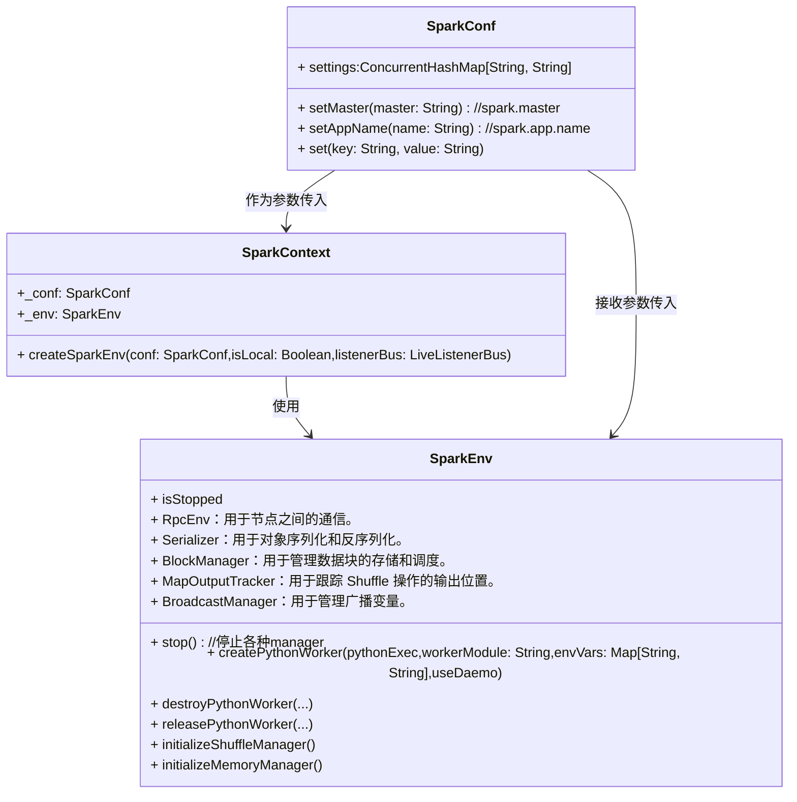

# SparkContext

`SparkContext` 是 Apache Spark 的核心对象，用于连接到 Spark 集群并创建 RDD（弹性分布式数据集）。它是 Spark 应用程序的入口点。通过 `SparkContext`，你可以访问 Spark 集群的资源，配置应用程序，提交作业以及管理应用程序的生命周期。

## 类图

SparkContext接收SparkConf类型的参数，然后创建env:SparkEnv,这是 Spark 中的一个关键类，负责管理和维护 Spark 应用程序的执行环境。它包含了许多重要的组件



下面是一些关于 `SparkContext` 的关键点：

### 1. 创建 SparkContext

创建 `SparkContext` 通常通过 `SparkConf` 对象来配置应用程序的相关设置，然后传递给 `SparkContext` 构造函数。

```scala
import org.apache.spark.{SparkConf, SparkContext}

// 创建 Spark 配置
val conf = new SparkConf().setAppName("MyApp").setMaster("local[*]")

// 创建 SparkContext
val sc = new SparkContext(conf)
```

### 2. 配置参数

`SparkConf` 可以设置很多参数，例如应用程序名称（`setAppName`）、集群的 URL（`setMaster`）等。这些参数可以影响应用程序的执行环境和性能。

```scala
val conf = new SparkConf()
  .setAppName("MyApp")
  .setMaster("local[*]")
  .set("spark.executor.memory", "2g")
```

### 3. 操作 RDD

通过 `SparkContext` 可以创建 RDD 并对其进行各种操作。常见的方法包括 `parallelize`（将本地集合并行化为 RDD）、`textFile`（读取文本文件）等。

```scala
// 并行化集合
val data = Array(1, 2, 3, 4, 5)
val rdd = sc.parallelize(data)

// 读取文本文件
val textFileRDD = sc.textFile("path/to/file.txt")
```

### 4. 分布式计算

`SparkContext` 提供了分布式计算的能力，支持将计算任务分发到集群中的各个节点上进行处理。常见的操作包括 `map`、`filter`、`reduce` 等。

```scala
val rdd = sc.parallelize(1 to 10)
val result = rdd.map(_ * 2).collect()
result.foreach(println)
```

### 5. 资源管理

`SparkContext` 负责管理应用程序的资源，例如执行器（Executor）和任务（Task）。通过 `SparkContext` 可以监控和调整资源的使用情况。

### 6. 停止 SparkContext

在应用程序完成后，应该调用 `stop` 方法来停止 `SparkContext`，释放资源。

```scala
sc.stop()
```

### 7. 广播变量和累加器

`SparkContext` 还提供了广播变量和累加器的功能，用于在分布式计算中共享变量和累加计数。

```scala
// 创建广播变量
val broadcastVar = sc.broadcast(Array(1, 2, 3))

// 创建累加器
val accum = sc.longAccumulator("My Accumulator")

rdd.foreach(x => accum.add(x))
println(accum.value)
```

### 总结

`SparkContext` 是 Spark 应用程序的核心组件，通过它可以配置应用、管理资源、执行分布式计算和处理数据。在使用 Spark 时，了解 `SparkContext` 的工作原理和使用方法是非常重要的。
