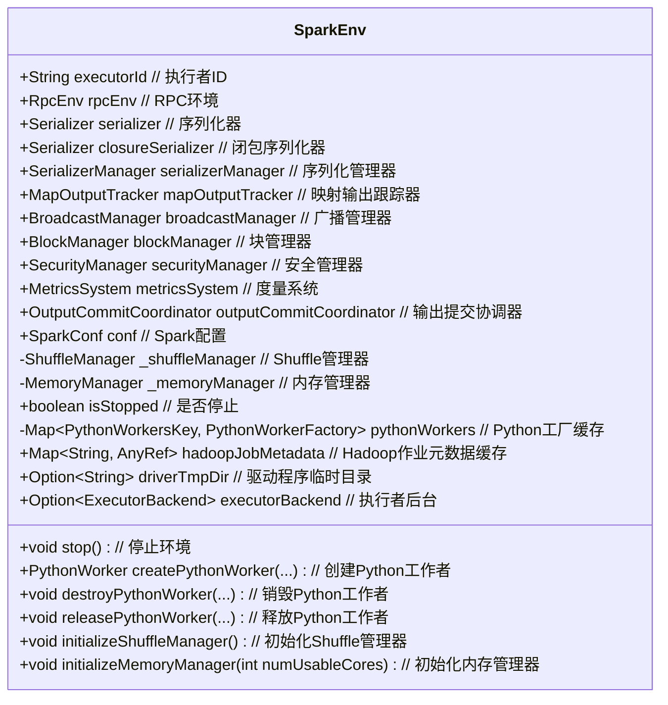

# SparkEnv

这段代码定义了 `SparkEnv` 类及其相关的功能，用于管理 Spark 运行时环境的各个组件，如序列化器、Rpc 环境、Block 管理器等。下面是对代码的关键部分的中文注释解释：

1. **类定义**:
    - `SparkEnv` 类持有 Spark 实例在运行时所需的各种环境对象，如序列化器、Rpc 环境、Block 管理器等。
    - `SparkEnv` 是一个单例类，所有线程通过 `SparkEnv.get` 方法可以访问相同的 `SparkEnv` 实例。

2. **Python Workers**:
    - `SparkEnv` 内部维护了一个 `pythonWorkers` 哈希映射，用于缓存 PythonWorkerFactory 的实例。不同的 Python 工作进程配置（例如 Python 可执行文件路径、工作模块、环境变量等）会对应不同的 `PythonWorkerFactory` 实例。
    - 提供了多个 `createPythonWorker` 和 `destroyPythonWorker` 方法用于创建和销毁 Python 工作进程。

3. **内存管理和 Shuffle 管理**:
    - `SparkEnv` 内部有一个可变的 `_memoryManager` 和 `_shuffleManager`，用于延迟初始化内存管理器和 Shuffle 管理器。
    - `initializeMemoryManager` 和 `initializeShuffleManager` 方法用于在 SparkContext 或执行器加载后初始化内存管理器和 Shuffle 管理器。

4. **停止 `SparkEnv`**:
    - `stop` 方法用于停止 `SparkEnv`，包括停止所有的 Python 工作进程、MapOutputTracker、Shuffle 管理器、Block 管理器等。
    - 如果是驱动程序实例，还会删除由驱动程序创建的临时目录。

5. **静态方法**:
    - `SparkEnv` 提供了一些静态方法用于创建和获取 `SparkEnv` 实例。
    - `createDriverEnv` 方法用于创建驱动程序的 `SparkEnv` 实例，`createExecutorEnv` 方法用于创建执行器的 `SparkEnv` 实例。

6. **序列化器和 Rpc 环境**:
    - 在创建 `SparkEnv` 时，会实例化一个序列化器对象，并根据配置创建 Rpc 环境 (`RpcEnv`)。
    - 如果是驱动程序实例，还会注册或查找必要的 Rpc 端点。

通过这些关键方法和组件，`SparkEnv` 提供了 Spark 在运行时所需的基础设施，使得各个组件可以协同工作，确保 Spark 应用程序的正常运行。

